# Production-Grade AI Agent Architecture

Source notes for [alapureram.com](https://alapureram.com) writing. Original series on [LinkedIn](https://www.linkedin.com/in/ramalapure/). Series index: <https://lnkd.in/deyWhjqB>

Each post keeps the original diagram and a Mermaid version for the site.

---

## Post #1 — Most AI demos work. Most AI systems fail in production.

- Date: 2026-02-17
- LinkedIn: <https://www.linkedin.com/posts/ramalapure_most-ai-demos-work-most-ai-systems-fail-activity-7429368552131809281-0vb3>

Most AI demos work.

Most AI systems fail in production.

Especially in regulated industries like banking, wealth management, and healthcare. AI cannot just be intelligent, It must be:

- Deterministic
- Observable
- Governed
- Auditable
- Fail-safe

LLMs are probabilistic by design, enterprise systems cannot afford to be. That’s the architectural tension.

In regulated environments, AI agents need more than prompts. They need architecture.

From what I’ve seen, production-grade AI systems require:

- Clear separation between Planner and Orchestrator
- Validation layers before execution
- Strict tool access control
- Deterministic guardrails around outputs
- Human fallback loops
- Full observability and audit trails

The real question is not: “How do we build an AI agent?”

It’s: “How do we make AI predictable?”

The future of enterprise AI won’t be shaped by better prompts, it will be shaped by better architecture patterns.

This is the space I’m actively exploring — designing deterministic AI systems for regulated industries.

Curious how others are approaching this balance between intelligence and control.

A simple control-loop view of deterministic AI architecture for regulated systems.

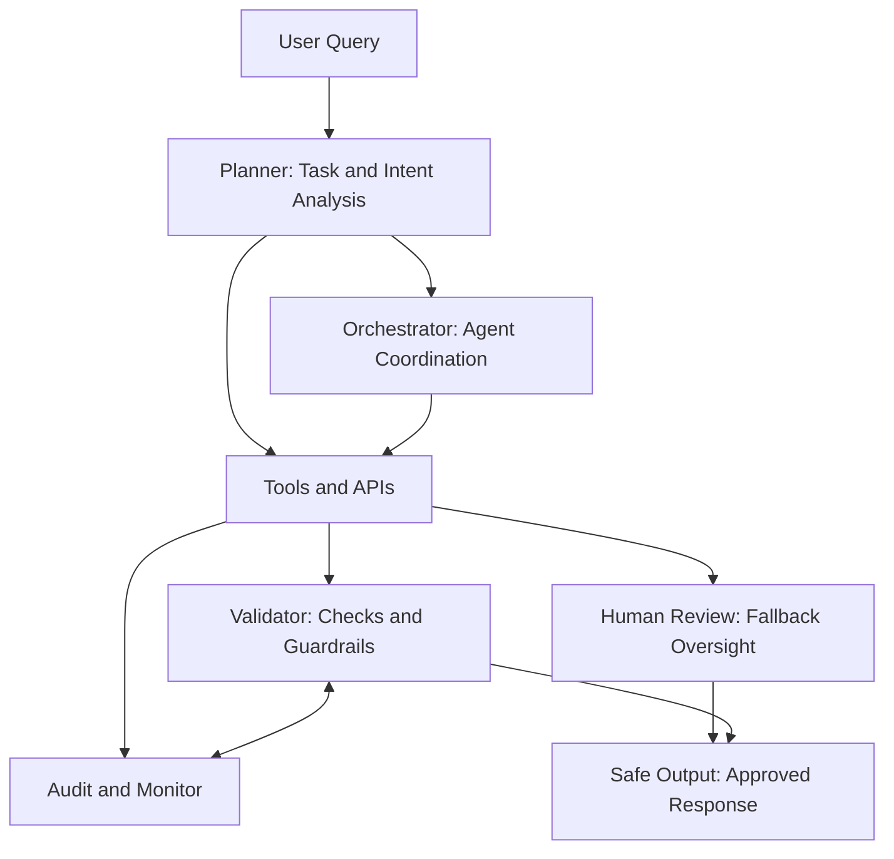
```mermaid
flowchart TD
  UserQuery[User Query] --> Planner[Planner: Task and Intent Analysis]
  Planner --> Orchestrator[Orchestrator: Agent Coordination]
  Planner --> Tools[Tools and APIs]
  Orchestrator --> Tools
  Tools --> Validator[Validator: Checks and Guardrails]
  Tools --> Audit[Audit and Monitor]
  Tools --> HumanReview[Human Review: Fallback Oversight]
  Validator <--> Audit
  HumanReview --> SafeOutput[Safe Output: Approved Response]
  Validator --> SafeOutput
```

---

## Post #2 — Agents must not execute tools from raw model output

- Date: 2026-02-19
- LinkedIn: <https://www.linkedin.com/posts/ramalapure_a-recurring-pattern-ive-seen-when-ai-agents-activity-7430268073825341440-dcGJ>

A recurring pattern I’ve seen when AI agents move from demo to production:

Everything works well — until the agent is allowed to execute tools without strict validation.

In controlled environments, model outputs look accurate and well-structured.

But in production, small ambiguities in intent classification or parameter extraction can lead to unintended tool invocation.

Nothing malicious.

Just probabilistic behavior meeting deterministic systems, and that’s the architectural tension.

In regulated industries, an AI agent should never execute actions directly from model output.

There must be a deterministic validation layer between orchestration and execution.

A simplified production-grade flow looks like this:

1. Planner → Generates structured intent
2. Orchestrator → Prepares tool invocation
3. Validator →
   - Checks intent confidence thresholds
   - Enforces role-based access control
   - Validates parameter schema
   - Applies policy constraints
   - Confirms allowed action scope
4. Only then → Tool execution

If validation fails:

- Clarify with the user
- Or route to human review

The difference between a demo agent and a production-grade agent is not prompt quality, it’s architectural control.

As agents gain autonomy, validation becomes the real safety boundary.

Should AI agents ever be allowed to execute critical APIs directly from raw model output?

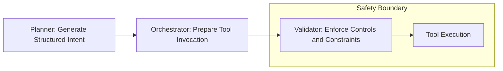
```mermaid
flowchart LR
  Planner[Planner: Generate Structured Intent] --> Orchestrator[Orchestrator: Prepare Tool Invocation]
  Orchestrator --> Validator[Validator: Enforce Controls and Constraints]
  Validator --> ToolExec[Tool Execution]
  subgraph safety [Safety Boundary]
    Validator
    ToolExec
  end
```

---

## Post #3 — Validation is not a single gate

- Date: 2026-02-22
- LinkedIn: <https://www.linkedin.com/posts/ramalapure_ai-agent-activity-7431381232552316928-Ax_Y>

Everyone agrees AI agents need validation before execution.

But what does that validator actually do?

In production systems, a validator is not just a boolean check, it’s a layered decision engine.

A simplified structure looks like this:

**Layer 1 – Structural Validation**

- Is the tool name allowed?
- Do parameters match the schema?
- Are required fields present?

**Layer 2 – Contextual Validation**

- Does the user have the required role?
- Is this action allowed in this session context?
- Is the data scope within policy?

**Layer 3 – Risk Evaluation**

- Confidence threshold met?
- Anomaly detection triggered?
- Rate limits exceeded?

**Layer 4 – Decision**

- Approve execution
- Ask for clarification
- Escalate to human

The insight: Validation is not a single gate, it’s a layered risk model.

That’s what transforms AI agents from experimental systems into production infrastructure.

How are others structuring layered decision logic in agent architectures?

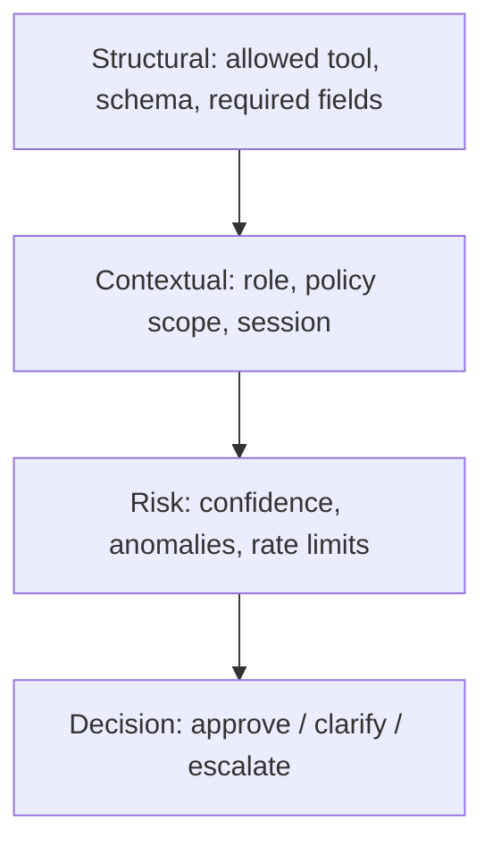
```mermaid
flowchart TD
  L1[Structural: allowed tool, schema, required fields]
  L2[Contextual: role, policy scope, session]
  L3[Risk: confidence, anomalies, rate limits]
  L4["Decision: approve / clarify / escalate"]
  L1 --> L2 --> L3 --> L4
```

---

## Post #4 — Production agents are distributed systems, not smarter prompts

- Date: 2026-02-24
- LinkedIn: <https://www.linkedin.com/posts/ramalapure_ai-agent-activity-7432051775983194112-ZuHC>

AI agents are often discussed as “smarter prompts.”

In production, they behave more like distributed systems.

Once an agent becomes multi-step, long-running, or tool-driven, you’re no longer just managing generation, you’re managing coordination.

Think about what actually happens in a real workflow:

- Intent planning
- Tool invocation
- Memory updates
- Policy checks
- State transitions
- Retry logic
- Audit logging

That’s orchestration and it introduces classic distributed systems challenges:

- State drift across steps
- Partial execution failures
- Idempotency requirements
- Tool timeouts
- Inconsistent memory writes
- Race conditions in concurrent flows

The failure mode is rarely “bad text", it’s broken state.

When we start modeling AI agents as stateful orchestrators rather than reasoning engines, design decisions change:

- Explicit state boundaries
- Deterministic transitions
- Clear failure recovery paths
- Observability at each step
- Controlled side effects

The intelligence matters, but the coordination layer determines reliability.

Are others treating agent systems as distributed workflows rather than prompt pipelines?

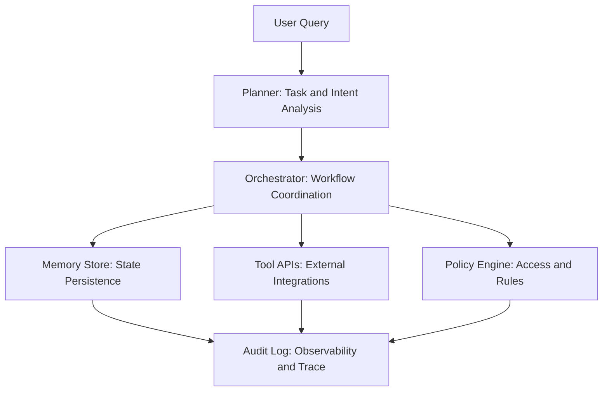
```mermaid
flowchart TD
  UserQuery[User Query] --> Planner[Planner: Task and Intent Analysis]
  Planner --> Orchestrator[Orchestrator: Workflow Coordination]
  Orchestrator --> Memory[Memory Store: State Persistence]
  Orchestrator --> Tools[Tool APIs: External Integrations]
  Orchestrator --> Policy[Policy Engine: Access and Rules]
  Memory --> Audit[Audit Log: Observability and Trace]
  Tools --> Audit
  Policy --> Audit
```

---

## Post #5 — Agents fail at observation, not only execution

- Date: 2026-02-26
- LinkedIn: <https://www.linkedin.com/posts/ramalapure_ai-agent-activity-7432828371211841536-dc9h>

AI agents don’t just fail at execution, they fail at observation.

In demos, if something goes wrong, we rerun the prompt.

In production systems, that’s rarely an option.

Once an agent orchestrates multiple steps — tool calls, memory updates, policy checks — failures become harder to detect and even harder to recover from.

Consider a few realistic scenarios:

- A tool call partially succeeds but returns incomplete data
- A retry unintentionally duplicates a side effect
- Memory is updated before execution fully completes
- A downstream API times out, but reasoning continues
- State drifts silently across multi-step workflows

The failure isn’t always visible and that’s the problem.

In distributed systems, reliability depends on:

- Step-level logging
- Correlation IDs across workflows
- Deterministic checkpoints
- Clear retry boundaries
- Defined rollback strategies

Agentic systems require the same discipline.

Without structured observability, autonomy becomes opaque automation.

As agents gain more autonomy, traceability and controlled recovery become more important than generation quality.

Curious how others are instrumenting agent workflows for step-level visibility and safe failure handling.

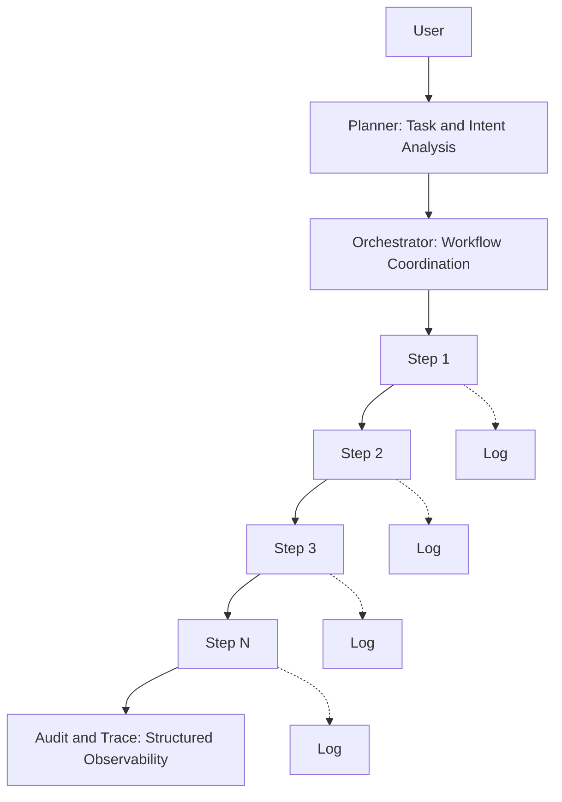
```mermaid
flowchart TD
  User[User] --> Planner[Planner: Task and Intent Analysis]
  Planner --> Orchestrator[Orchestrator: Workflow Coordination]
  Orchestrator --> S1[Step 1]
  S1 --> S2[Step 2]
  S2 --> S3[Step 3]
  S3 --> SN[Step N]
  SN --> Audit[Audit and Trace: Structured Observability]
  S1 -.-> L1[Log]
  S2 -.-> L2[Log]
  S3 -.-> L3[Log]
  SN -.-> LN[Log]
```

---

## Post #6 — Resilience is replay-safe execution, not more retries

- Date: 2026-02-28
- LinkedIn: <https://www.linkedin.com/posts/ramalapure_ai-agent-activity-7433516104494424064-3cdt>

Retries don’t automatically create reliability.

In multi-step AI agent workflows, they can introduce new failure modes.

Consider a simple execution flow:

- Step 1 — writes to a database
- Step 2 — calls an external API
- Step 3 — updates memory state

Now imagine Step 2 times out.

The system retries the workflow, but Step 1 already committed.

Without idempotent boundaries, the retry doesn’t restore consistency — it duplicates side effects.

In distributed systems, this is a familiar problem. We address it using:

- Idempotency keys
- Deterministic checkpoints
- Explicit state transitions
- Clear separation between reasoning and write operations

Agent systems require the same discipline.

Autonomy increases the surface area for unintended side effects.

Resilience isn’t just about retry logic, it’s about controlled state progression and replay-safe execution paths.

As agents become more capable, idempotent design becomes foundational — not optional.

Curious how others are designing safe retry strategies in multi-step agent workflows.

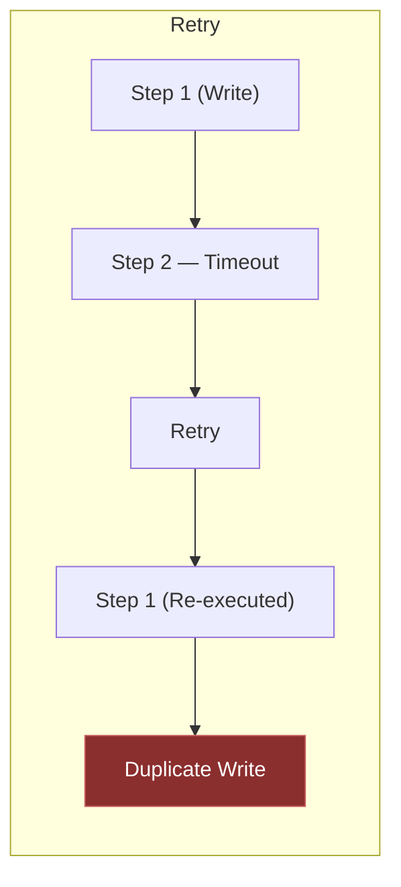
```mermaid
flowchart TB
  subgraph bad ["Retry"]
    direction TB
    B1["Step 1 (Write)"] --> B2["Step 2 — Timeout"]
    B2 --> B3["Retry"]
    B3 --> B4["Step 1 (Re-executed)"]
    B4 --> B5["Duplicate Write"]
  end
  classDef fail fill:#8b2e2e,stroke:#c45c5c,color:#fff
  class B5 fail
```

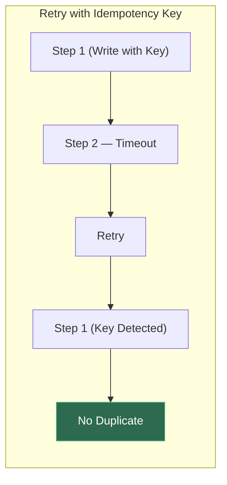
```mermaid
flowchart TB
  subgraph good ["Retry with Idempotency Key"]
    direction TB
    G1["Step 1 (Write with Key)"] --> G2["Step 2 — Timeout"]
    G2 --> G3["Retry"]
    G3 --> G4["Step 1 (Key Detected)"]
    G4 --> G5["No Duplicate"]
  end
  classDef ok fill:#2d6a4f,stroke:#52b788,color:#fff
  class G5 ok
```

---

## Post #7 — Agents are distributed transaction coordinators

- Date: 2026-03-03
- LinkedIn: <https://www.linkedin.com/posts/ramalapure_ai-agent-resilience-activity-7434506374165815296-QmEF>

AI agents don’t just fail at execution, they fail at state consistency.

In multi-step workflows, retries are often treated as recovery.

But retries handle transient failure — not state rollback.

Consider this sequence:

- Step 1 → Reserve Funds (Committed)
- Step 2 → Ledger Entry (Committed)
- Step 3 → Notify Settlement (Fails)

If Step 3 fails:

You retry.

You retry again.

Eventually retries exhaust.

What remains?

- Funds reserved
- Ledger updated
- No settlement confirmation

The system is now in an inconsistent state.

Retry loops cannot revert committed steps.

This is where the Saga pattern becomes necessary.

Instead of retrying forward, the system compensates backward:

- Step 3 fails
- Compensate Step 2 (Reverse Ledger Entry)
- Compensate Step 1 (Release Funds)

State is restored, but here’s the part most people ignore: Compensation can fail too.

If reverse ledger entry fails, you now need escalation:

- Human intervention
- Manual reconciliation
- Audit visibility

Agents orchestrating multi-step tool calls are effectively distributed transaction coordinators.

Distributed coordination requires:

- Retry policies
- Compensation logic
- Escalation paths

Not just better prompts, compensation logic is critical for state restoration.

Plan for compensation failures with escalation protocols.

Curious how others are handling compensation and failure escalation in agent workflows?

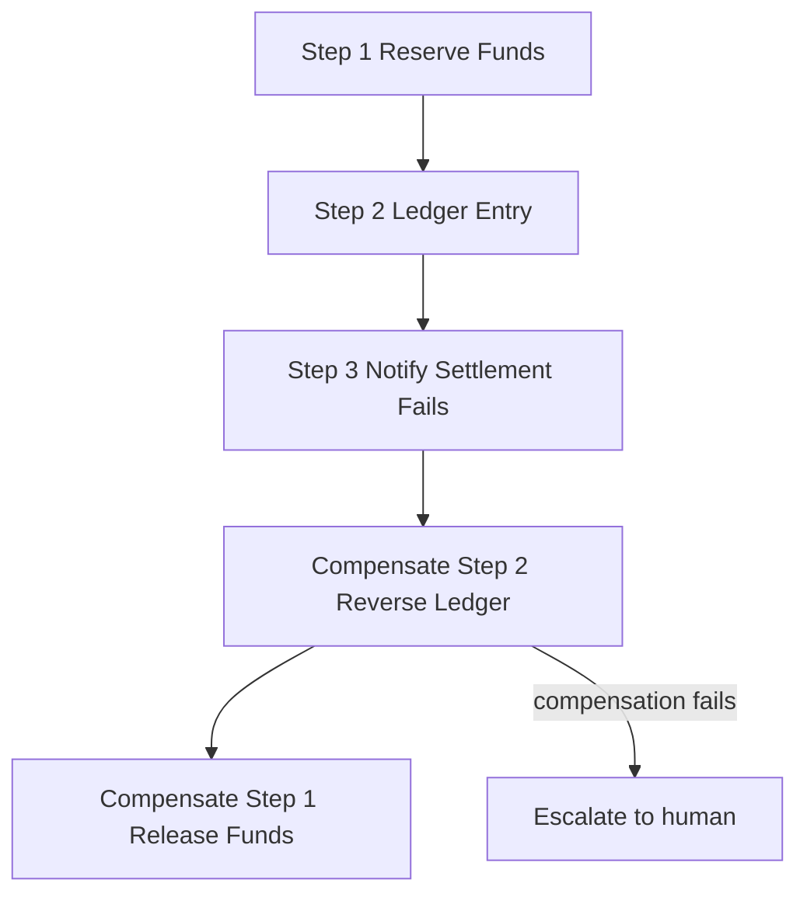
```mermaid
flowchart TD
  S1[Step 1 Reserve Funds] --> S2[Step 2 Ledger Entry]
  S2 --> S3[Step 3 Notify Settlement Fails]
  S3 --> C2[Compensate Step 2 Reverse Ledger]
  C2 --> C1[Compensate Step 1 Release Funds]
  C2 -->|compensation fails| Esc[Escalate to human]
```

---

## Post #8 — The illusion of autonomous agents

- Date: 2026-03-06
- LinkedIn: <https://www.linkedin.com/posts/ramalapure_ai-agent-activity-7435520123098189825-Reyr>

The Illusion of Autonomous Agents

We keep calling them autonomous, technically most aren’t.

An autonomous system must satisfy at least three properties:

1. Goal ownership – It can define or refine objectives.
2. Constraint negotiation – It can resolve conflicting requirements.
3. Outcome responsibility – It can absorb failure without external intervention.

Most production “agents” satisfy none of these.

They operate under:

- Predefined goals
- Predefined tools
- Predefined authority scope
- Predefined escalation paths

They optimize within constraints, they do not redefine them.

When something ambiguous happens, the system does not adapt its objectives, it escalates.

That’s not autonomy, it's bounded optimization.

Technically, what we’ve built are:

- Decision pipelines with probabilistic routing
- Tool selection layers
- Policy-constrained executors
- Structured orchestration graphs

They are adaptive inside a sandbox.

True autonomy would require:

- Dynamic goal reformation
- Authority expansion or contraction
- Independent risk evaluation
- Self-modifying execution plans

We are nowhere near that in production systems, and that’s intentional.

Because real autonomy implies real risk.

The term “autonomous agent” is a marketing abstraction.

The implementation reality is: Controlled delegation.

If your agent cannot redefine success criteria or operate beyond predefined authority, it isn’t autonomous.

It’s automated with adaptive inference.

What level of autonomy would you actually allow in a production system?

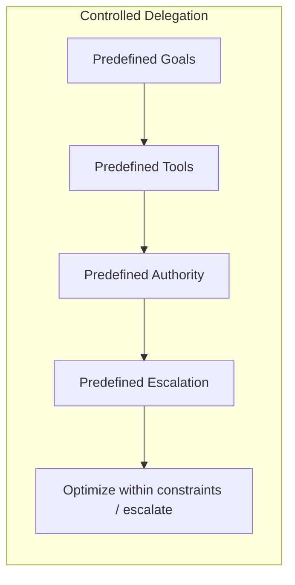
```mermaid
flowchart TB
  subgraph controlled ["Controlled Delegation"]
    direction TB
    CG[Predefined Goals] --> CT[Predefined Tools]
    CT --> CA[Predefined Authority]
    CA --> CE[Predefined Escalation]
    CE --> CO["Optimize within constraints / escalate"]
  end
```

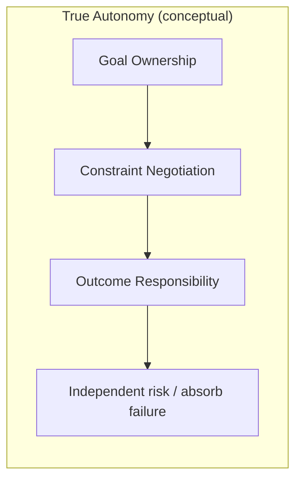
```mermaid
flowchart TB
  subgraph trueAuto ["True Autonomy (conceptual)"]
    direction TB
    TG[Goal Ownership] --> TN[Constraint Negotiation]
    TN --> TR[Outcome Responsibility]
    TR --> TO["Independent risk / absorb failure"]
  end
```

---

## Post #9 — Planner risk: is the plan safe to execute?

- Date: 2026-03-08
- LinkedIn: <https://www.linkedin.com/posts/ramalapure_ai-agent-activity-7436342711500300288-iqox>

In most agent discussions, the focus is on the model.

But in production systems, the real risk sits elsewhere.

The planner.

The planner decides:

- which tools to call
- what sequence to execute
- how the workflow unfolds

In other words, it defines the execution graph of the system.

Once a plan is created, the orchestrator simply runs it.

Which means a flawed planner can introduce failures even when the model is correct and the infrastructure is stable.

Common planner failure modes in agent systems:

- Incorrect step ordering — Critical validation steps happen after irreversible actions.
- Wrong tool invocation — The planner selects the wrong capability for the task.
- Infinite planning loops — The system repeatedly generates new reasoning steps with no termination condition.
- Unbounded execution chains — Each step spawns additional sub-steps, expanding the workflow unexpectedly.
- Cost amplification — Planning loops trigger repeated model calls and tool executions.

Unlike reasoning errors, planner failures are difficult to detect.

- The outputs may look valid.
- The tools may execute successfully.

But the execution path itself is wrong.

In production architectures, the planner is effectively the control layer of the agent.

Which means the most important question isn’t: “Is the model correct?”

It’s: “Is the plan safe to execute?”

Curious how others are validating planner decisions before execution in agent workflows.

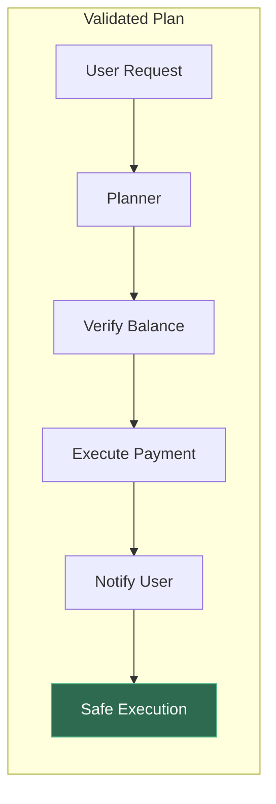
```mermaid
flowchart TB
  subgraph ok ["Validated Plan"]
    direction TB
    U1[User Request] --> P1[Planner]
    P1 --> V1[Verify Balance]
    V1 --> Pay1[Execute Payment]
    Pay1 --> N1[Notify User]
    N1 --> Safe[Safe Execution]
  end
  classDef okNode fill:#2d6a4f,stroke:#52b788,color:#fff
  class Safe okNode
```

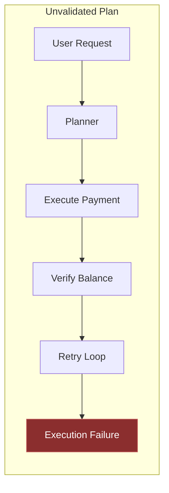
```mermaid
flowchart TB
  subgraph bad ["Unvalidated Plan"]
    direction TB
    U2[User Request] --> P2[Planner]
    P2 --> Pay2[Execute Payment]
    Pay2 --> V2[Verify Balance]
    V2 --> Loop[Retry Loop]
    Loop --> Fail[Execution Failure]
  end
  classDef failNode fill:#8b2e2e,stroke:#c45c5c,color:#fff
  class Fail failNode
```

---

## Post #10 — Agents need authority boundaries

- Date: 2026-03-13
- LinkedIn: <https://www.linkedin.com/posts/ramalapure_ai-agent-activity-7438110584300158976-R7rW>

Agents Need Authority Boundaries

In many agent systems, the planner generates a plan and the system proceeds to execute it.

But production-grade agents cannot execute everything they plan.

Because agents operate in environments with real consequences:

- financial transactions
- customer data access
- external API calls
- system configuration changes
- long-running workflows

A plan may be logically correct — but still outside the agent’s authority.

For example:

- sending an email may be allowed
- transferring funds may require approval
- modifying records may require policy checks
- triggering workflows may exceed limits
- calling external APIs may require permissions

This is why production agent architectures introduce authority boundaries.

In production systems, execution is not triggered directly by the planner.

Instead, multiple control layers decide what is allowed to run.

Each layer has a different responsibility.

- Planner → decides what should be done
- Orchestrator → coordinates the workflow
- Authority Boundary → decides what the agent is allowed to do
- Validator → checks parameters, policies, and safety rules
- Tools / APIs → execute actions in a controlled way

Actions outside the allowed boundary are:

- rejected
- restricted
- require approval
- or escalated to humans

Because the real challenge in agent systems isn’t generating plans, it’s controlling how much power the agent has to execute them.

Curious how others are defining authority boundaries in production agent architectures.

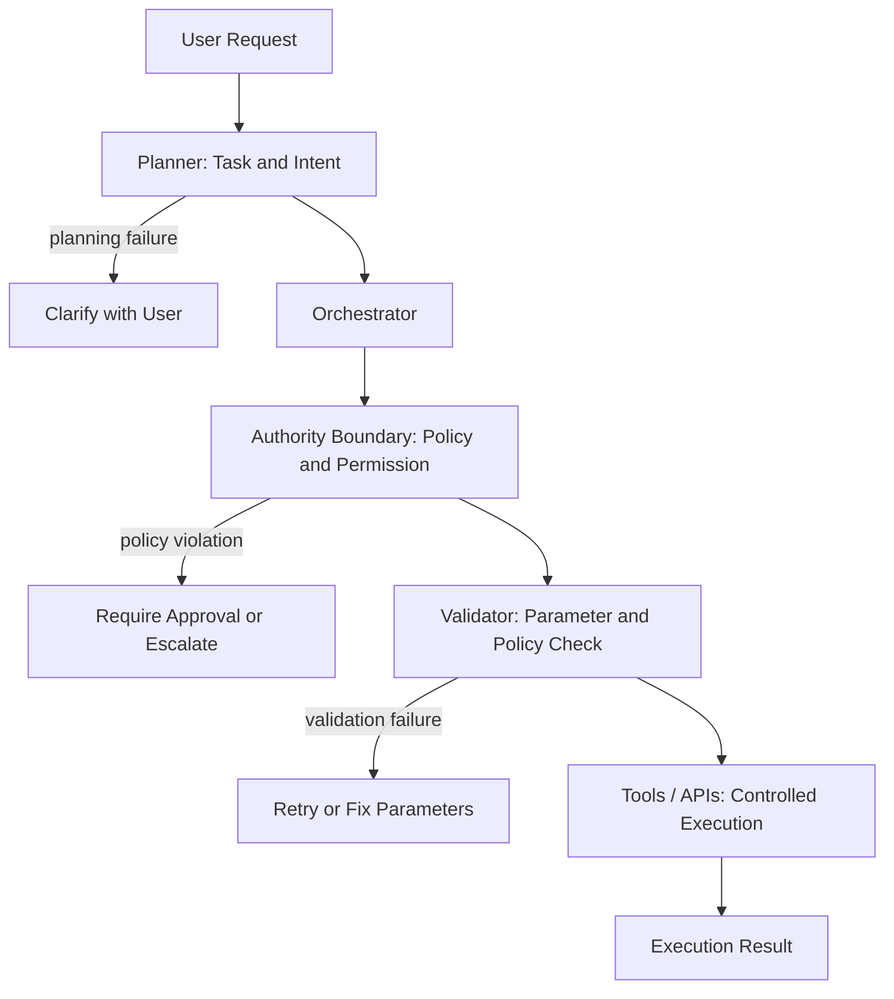
```mermaid
flowchart TD
  User[User Request] --> Planner[Planner: Task and Intent]
  Planner -->|planning failure| Clarify[Clarify with User]
  Planner --> Orchestrator[Orchestrator]
  Orchestrator --> Authority[Authority Boundary: Policy and Permission]
  Authority -->|policy violation| Approve[Require Approval or Escalate]
  Authority --> Validator[Validator: Parameter and Policy Check]
  Validator -->|validation failure| Retry[Retry or Fix Parameters]
  Validator --> Tools["Tools / APIs: Controlled Execution"]
  Tools --> Result[Execution Result]
```

---

## Post #11 — 10 architecture lessons from building production-grade AI agents

- Date: 2026-03-17
- LinkedIn: <https://www.linkedin.com/posts/ramalapure_ai-agent-activity-7439545533654007808-oioB>

10 Architecture Lessons from Building Production-Grade AI Agents

Over the last few weeks, I shared a series of posts about designing production-grade AI agents.

Not demos.

Not toy workflows.

Real systems with control, safety, and failure handling.

While writing these posts, one thing became clear:

Production agents are not just LLM calls, they are layered systems.

Here is a quick recap of the first 10 posts in the series:

1. [Demo Agents vs Production Agents](/writing/post-01/) — Production agents need deterministic control layers
2. [Guard Layer Pattern](/writing/post-02/) — LLM output should pass through a safety / guard layer
3. [Validation Layer in Agent Systems](/writing/post-03/) — Agents should validate tool calls before execution
4. [Agents are Distributed Systems](/writing/post-04/) — The failure mode is rarely "bad text", it's broken state
5. [Agent Failures Need Observability](/writing/post-05/) — You cannot fix what you cannot trace
6. [Retry vs Compensation](/writing/post-06/) — Retries handle transient failures, not state rollback
7. [Compensation + Escalation Pattern](/writing/post-07/) — Compensation may fail → need escalation
8. [Illusion of Autonomous Agents](/writing/post-08/) — Production agents run inside controlled boundaries
9. [Planner Risk in Agent Systems](/writing/post-09/) — Wrong plans can break the system
10. [Authority Boundaries in Agents](/writing/post-10/) — Agents should not execute everything they plan

Across these posts, a pattern emerges. Production AI agents usually need:

- Planner
- Orchestrator
- Authority Boundary
- Validator
- Controlled Execution
- Retry / Compensation
- Escalation
- Observability

Planning is probabilistic. Execution must remain deterministic.

I’ll continue the series with deeper topics on production agent architecture.

If you’ve been following the journey — thank you. If you’re new, this post is a good place to start.

Let me know what you think of the architecture diagram in the comments!

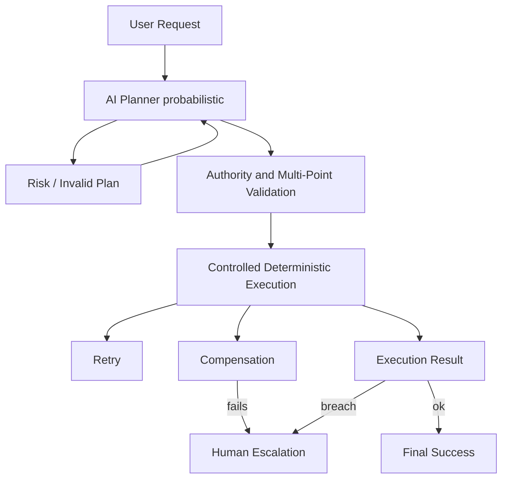
```mermaid
flowchart TD
  User[User Request] --> Planner[AI Planner probabilistic]
  Planner --> Detect["Risk / Invalid Plan"]
  Detect --> Planner
  Planner --> Auth[Authority and Multi-Point Validation]
  Auth --> Exec[Controlled Deterministic Execution]
  Exec --> Retry[Retry]
  Exec --> Comp[Compensation]
  Comp -->|fails| Esc[Human Escalation]
  Exec --> Result[Execution Result]
  Result -->|ok| Success[Final Success]
  Result -->|breach| Esc
```

---

## Post #12 — Production AI agents need a knowledge layer (not just prompts)

- Date: 2026-03-21
- LinkedIn: <https://www.linkedin.com/posts/ramalapure_ai-agent-activity-7441012428265537536-XHii>

In the [last 10 posts](/writing/post-11/), we built the core architecture for production-grade AI agents:

- Planner
- Orchestrator
- Validator
- Authority Boundary
- Retry / Compensation
- Observability

But one critical layer is still missing — Knowledge.

Not just conversation history.

Not dynamic prompt context.

Real, authoritative knowledge.

Production agents must know where the truth comes from.

**The Demo Agent: Model as Database**

User → LLM → Answer

The classic prototype flow. It works in a demo, but it fails in production. When you rely on the LLM's internal memory:

- The model relies on frozen weights (static training data).
- The model guesses.
- The model hallucinates.

The architecture is too fragile for real business.

**The Production Agent: Model as Processor**

- User Request
- Planner
- Orchestrator
- Knowledge Layer (RAG/DB)
- Tools / APIs
- Validator
- Authority Boundary
- Retry / Compensation
- Observability
- Response

In production, the agent does not rely on knowledge stored inside the model.

The LLM is the reasoning engine, not the database. The architecture must retrieve facts from reliable systems of record.

**Why a Knowledge Layer is Non-Negotiable**

Production agents are required to handle high-stakes data that an LLM cannot store safely or update dynamically:

- Customer transaction history
- Real-time inventory levels
- Proprietary policy documents
- Live enterprise API schemas

The architecture must provide this ground truth. This is where RAG (Retrieval-Augmented Generation), vector databases, structured DBs, and API integrations become foundational.

**The Four Types of Memory in Production Agents**

A production agent uses different memory systems simultaneously. They are not interchangeable:

1. Short-term memory → User conversation state (the chat history).
2. Long-term memory → Knowledge base (Vector DB / RAG).
3. System memory → Agent workflow state / execution context.
4. Enterprise knowledge → Structured systems of record (SQL, APIs).

Not just chat history. Reliable agents use all four.

**The Key Rule**

LLM generates text.

Knowledge layer provides facts.

Orchestrator controls usage.

Validator checks output.

Reliability comes from architecture, not from prompt engineering.

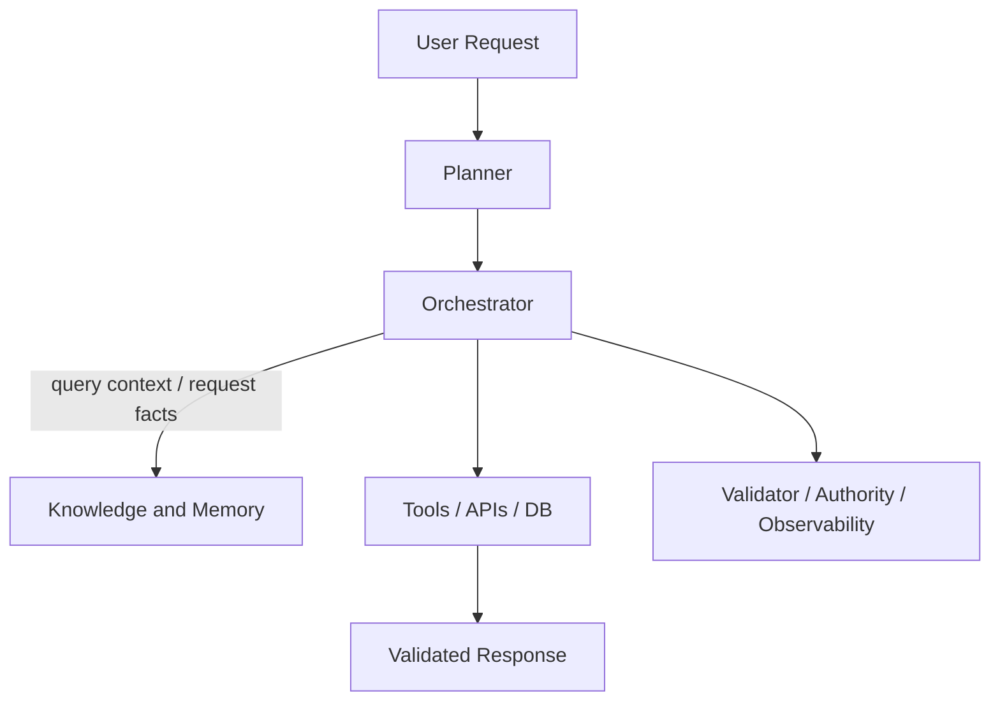
```mermaid
flowchart TD
  User[User Request] --> Planner[Planner]
  Planner --> Orchestrator[Orchestrator]
  Orchestrator -->|query context / request facts| Knowledge[Knowledge and Memory]
  Orchestrator --> Tools["Tools / APIs / DB"]
  Orchestrator --> Gov["Validator / Authority / Observability"]
  Tools --> Response[Validated Response]
```

---

## Post #13 — If you don't have evals, you don't have a production agent

- Date: 2026-03-23
- LinkedIn: <https://www.linkedin.com/posts/ramalapure_ai-agent-eval-activity-7441687034655617024-GSO3>

We spent the [last 12 posts](/writing/) building a rock-solid, enterprise-grade AI architecture.

Planner. Orchestrator. Validator. Knowledge Layer, etc.

You built it. It runs.

But how do you know it won't break tomorrow?

Traditional software has unit tests.

AI agents need Evals.

**Demo Agent Testing**

Run a prompt.

Read the output.

"Looks good to me." (LGTM)

Works for prototypes.

Disaster for production.

You cannot manually QA a non-deterministic system.

**Production Agent Testing (Evals)**

Production teams treat AI like a CI/CD pipeline. Every change to a prompt, tool, or routing logic must pass an automated evaluation suite before deployment.

We test for:

1. Accuracy — Did it get the right facts from the Knowledge Layer?
2. Format — Did it output clean JSON?
3. Tone/Policy — Did it stay within the Authority Boundary?
4. Latency — Did the Orchestrator take too long to plan?

**The 3 Layers of Agent Evaluations**

1. Deterministic Evals (The Basics)

   Standard code checks.

   - Did the agent call the right API?
   - Is the output exactly 250 words?
   - Does the JSON schema match?

   Fast, cheap, binary.

2. Semantic Evals (The Middle Ground)

   Vector math.

   - Is the meaning of the answer mathematically similar to our "Golden Dataset" of perfect answers?

   Catches hallucinated terminology.

3. LLM-as-a-Judge (The Heavy Lifter)

   Using a stronger, slower model to grade your agent's output based on a strict rubric.

   - "Did the agent politely decline to answer out-of-scope questions?" (Pass/Fail)

   Scales human-level judgment.

**The CI/CD Flow for AI**

Developer tweaks the system prompt

↓

Triggers Eval Pipeline (100 test cases)

↓

Deterministic checks run

↓

LLM-as-a-Judge grades responses

↓

Score drops below 95%? Deployment blocked.

**Key Rule**

If you can't measure it automatically, you can't scale it.

Vibe checks are not a testing strategy.

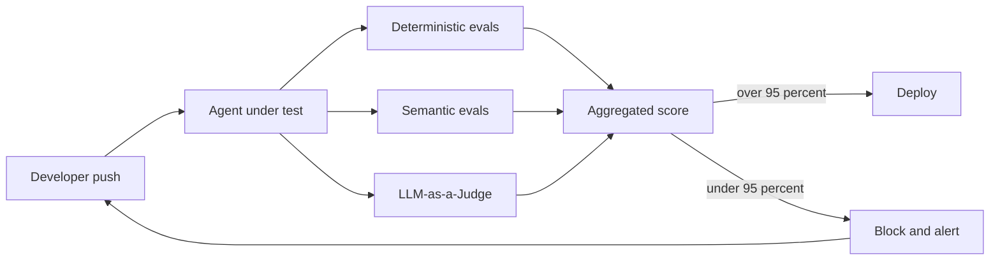
```mermaid
flowchart LR
  Dev[Developer push] --> Agent[Agent under test]
  Agent --> Det[Deterministic evals]
  Agent --> Sem[Semantic evals]
  Agent --> Judge[LLM-as-a-Judge]
  Det --> Score[Aggregated score]
  Sem --> Score
  Judge --> Score
  Score -->|over 95 percent| Deploy[Deploy]
  Score -->|under 95 percent| Block[Block and alert]
  Block --> Dev
```

---

## Post #14 — The God Agent is dead. Long live multi-agent routing

- Date: 2026-03-25
- LinkedIn: <https://www.linkedin.com/posts/ramalapure_ai-agent-activity-7442414033821016064-IVAe>

We’ve spent the [last 13 posts](/writing/) building a production-grade AI agent.

It works beautifully. Until the system scales.

What happens when your enterprise agent needs:

- 50+ tools
- Multiple isolated databases
- Complex, multi-step workflows
- Cross-domain business logic

If you stuff all of that into one Orchestrator prompt…

The system collapses.

This is where most demo architectures fail.

**Demo Architecture — The God Agent**

One agent. One massive prompt. All the tools.

Everything is shoved into a single context window.

Result:

- Wrong tool calls
- Hallucinated data
- Context overflow
- Unpredictable execution

The bigger the prompt, the less reliable the agent.

**Production Architecture — Supervisor & Worker Pattern**

Enterprise systems don’t rely on a single monolithic service.

They use specialized components.

Production AI should do the same.

Instead of one God Agent, we build a Supervisor + Worker architecture.

**1. Supervisor Agent (The Router)**

The supervisor does not execute tools, its only job is to:

- Classify user intent
- Break the task into steps
- Route work to the right agent
- Coordinate the shared state

It is the control plane.

Flow: User → Supervisor → Workers → Supervisor → Result.

**2. Worker Agents (Specialized & Narrow)**

Each worker has a narrow prompt, a small toolset, and a clear responsibility.

For example: "Analyze Q3 revenue, update the CRM, and email the VP."

- Data Analyst Agent → SQL + Python only
- CRM Agent → CRM APIs only
- Communications Agent → Email + Templates only

Fewer tools = fewer mistakes.

Narrow prompts scale infinitely better than giant prompts.

**3. Shared State / Agentic Memory Bus**

Workers don’t talk to each other directly.

(That causes infinite loops).

Workers write their results to a shared state.

The Supervisor reads that state and decides the next step.

Worker → State

State → Supervisor

Supervisor → Next Worker

This keeps the system controlled. Not chaotic.

**The Architecture Rule**

One agent → Demo

Multi-agent routing → Production

Big prompts → Unstable

Narrow agents → Predictable

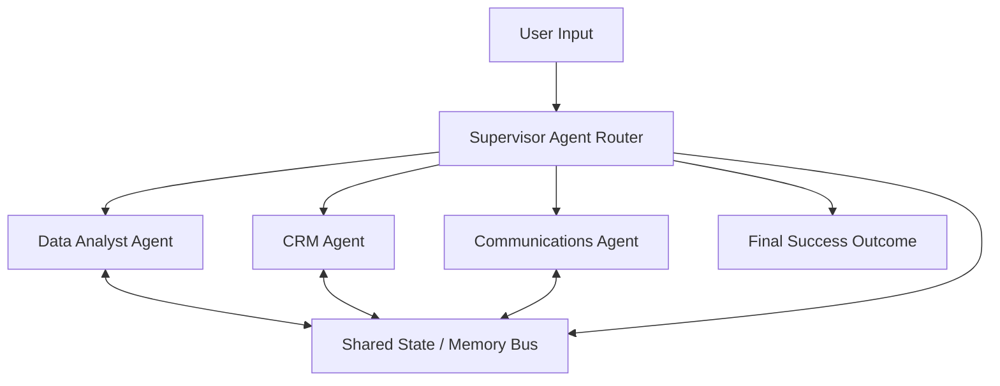
```mermaid
flowchart TD
  User[User Input] --> Supervisor[Supervisor Agent Router]
  Supervisor --> Analyst[Data Analyst Agent]
  Supervisor --> CRM[CRM Agent]
  Supervisor --> Comms[Communications Agent]
  Analyst <--> State["Shared State / Memory Bus"]
  CRM <--> State
  Comms <--> State
  Supervisor --> State
  Supervisor --> Result[Final Success Outcome]
```

---

## Post #15 — Multi-agent systems need a Human Gateway

- Date: 2026-04-04
- LinkedIn: <https://www.linkedin.com/posts/ramalapure_ai-agent-aiarchitecture-activity-7446090916664123393-UN0u>

We’ve [built the system](/writing/)

Multi-agents ✔️

Shared memory bus ✔️

Routing + orchestration ✔️

It’s efficient.

It’s powerful.

But it’s still probabilistic.

**The Enterprise Reality**

In enterprise systems, the cost of being wrong isn’t theoretical—it’s a liability.

What happens when an agent:

- Deletes “inactive” leads that are actually high-value?
- Executes flawed code on a production database?
- Sends a confidential contract to the wrong recipient?

You can test for 1,000 edge cases.

The 1,001st will happen in production.

Enterprise agents need probation and probation needs a Human Gateway.

**The Pattern: Human Gateway (HITL Done Right)**

This isn’t just feedback.

It’s an architectural control point.

We don’t remove probabilistic systems— we contain them with deterministic boundaries.

**Demo Architecture — Full Autonomy (The Risk)**

Flow:

Supervisor → Comms Agent → Tool Execution

Directive: “Draft and send email”

The Failure: The agent directly executes the tool call.

If the model hallucinates, the action is already irreversible.

No checkpoint.

No rollback.

No control.

**Production Architecture — Human Gateway Pattern**

We introduce a Pause State before critical actions.

Workflow Shift

- Draft & Execute
- Draft & Propose

**Execution Mechanism**

- Worker generates proposed action (e.g., email draft)
- Writes tool call (JSON) to Shared State
- Sets status → `AWAITING_HUMAN_APPROVAL`
- Orchestrator pauses execution
- State is surfaced to a Human-in-the-Loop interface

**The Gatekeeper (Human Operator)**

At this boundary, human input becomes deterministic control:

- Approve → Execution resumes
- Reject → Workflow stops or compensates
- Modify → Human-adjusted execution

System resumes only after validated input.

**The Architecture Rules for 2026**

1. Reasoning → Probabilistic — Used for: Exploration, drafting, demos — Mode: Fast, flexible, non-binding
2. Execution → Deterministic — Used for: Production actions — Mode: Controlled, validated, auditable
3. Non-Critical Tasks → Automate — Examples: Logs, summaries, tagging — Mode: Straight-through processing
4. High-Stakes Actions → Human Gateway — Examples: Financial, PII, external communication — Mode: Draft → Propose → Approve

**Final Thought**

The goal is not full autonomy.

The goal is controlled, trusted autonomy.

Not agents that act fast—

but systems that pause, validate, and then act safely.

The Human Gateway is what transforms an experimental agent into an enterprise-ready system.

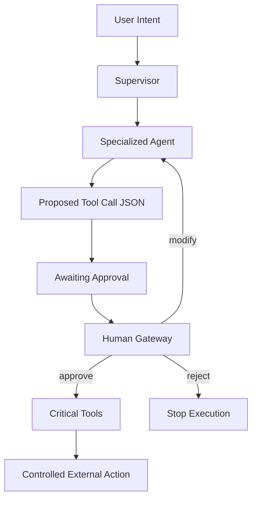
```mermaid
flowchart TD
  User[User Intent] --> Supervisor[Supervisor]
  Supervisor --> Agent[Specialized Agent]
  Agent --> Propose[Proposed Tool Call JSON]
  Propose --> Pause[Awaiting Approval]
  Pause --> Human[Human Gateway]
  Human -->|approve| Tools[Critical Tools]
  Human -->|modify| Agent
  Human -->|reject| Stop[Stop Execution]
  Tools --> Done[Controlled External Action]
```

---

## Post #16 — Stop asking your LLM to behave

- Date: 2026-04-18
- LinkedIn: <https://www.linkedin.com/posts/ramalapure_ai-agent-aiarchitecture-activity-7451149596275335168-hgfk>

In a demo, a system prompt is enough.

In Enterprise Production, a system prompt is a liability.

If your defense against prompt injection or PII leakage is just a "Please don't do this" instruction, you aren't building architecture. You’re building on hope.

**The Enterprise AI Firewall Pattern**

To move to a deterministic system, security must be a decoupled architectural layer, not a prompt. By isolating the LLM in a "Zero-Trust Zone," we move from probabilistic "vibes" to architectural guarantees.

**The 5-Tier Deterministic Security Pattern**

1. **Input Firewall (Deterministic Guardrails)**
   - Structural Validation: Use Schema and Regex checks to enforce data types before they reach the model.
   - Intent Mapping: Requests are cross-referenced against a Deterministic Rule-Set. If the intent isn't authorized, the request is killed before it ever touches the LLM.

2. **Control Plane (The Deterministic Core)**
   - Context Shadow: PII Tokenization swaps sensitive data for tokens (e.g., `USER_88`).
   - Secure Retrieval: The LLM never sees your "raw" database. It only interacts with a Masked Knowledge Layer.

3. **Output Firewall (The Guard)**
   - Leakage Scanning: Real-time scanning for Secrets, PII, or API keys in the generated response.
   - Policy Validation: Cross-checking the output against enterprise compliance rules.

4. **Safe Delivery (The Decoupled Rehydration)**
   - Conditional Logic: PII Rehydration happens only after a validated 'Pass' signal. We never trust the LLM to handle raw PII in its internal reasoning space.

5. **Telemetry & Audit (The Observability Stack)**
   - Centralized Logging: Every block, pass, and escalation is fed into your Enterprise SOC.
   - Anomaly Detection: Real-time monitoring of policy usage to detect evolving jailbreak patterns.

**The Architect's Take**

Security is Middleware.

Compliance teams and CISOs don't care about "good prompts"—they care about verifiable controls. By wrapping the untrusted LLM in a deterministic firewall, you provide the safety audit trail required for regulated industries like banking and healthcare.

How are you "hardening" your agentic workflows for production?

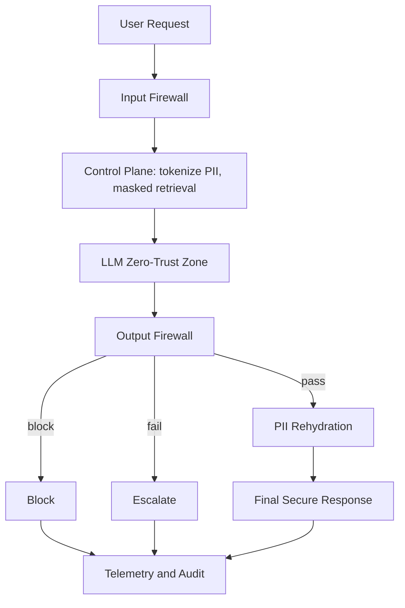
```mermaid
flowchart TD
  User[User Request] --> InputFW[Input Firewall]
  InputFW --> Control[Control Plane: tokenize PII, masked retrieval]
  Control --> LLM[LLM Zero-Trust Zone]
  LLM --> OutFW[Output Firewall]
  OutFW -->|fail| Escalate[Escalate]
  OutFW -->|pass| Rehydrate[PII Rehydration]
  OutFW -->|block| Block[Block]
  Rehydrate --> Safe[Final Secure Response]
  Block --> Telemetry[Telemetry and Audit]
  Escalate --> Telemetry
  Safe --> Telemetry
```

---

## Post #17 — Stop letting your LLM see your secrets

- Date: 2026-07-29
- LinkedIn: <https://www.linkedin.com/posts/ramalapure_ai-aiagents-aiarchitecture-activity-7488080411840118784-MCQJ>

Most AI applications mask PII once before sending a prompt to the LLM. That works for simple chatbots. But Agentic AI is different.

An AI agent reasons, invokes tools, receives API responses, plans the next action, and repeats the process. If sensitive information is only masked at the front door, new PII introduced by internal APIs can silently leak back into the LLM during subsequent reasoning steps.

The solution isn't better system prompts. It's building a continuous PII Protection Gateway (an AI Firewall) for bidirectional masking.

Here is how enterprise architectures secure multi-turn agent workflows:

**Step 1: Layered PII Detection**

Relying purely on Regex causes massive false positives. Robust detection pipelines combine multiple techniques to find the data:

- Regex & Checksums: (e.g., Luhn algorithm to validate credit cards).
- Context-Aware Rules: Scanning for proximity keywords (like "Acct:") near numbers.
- Small Model NER

**Step 2: Tokenization & Vaulting**

Active agents can't execute APIs with `[REDACTED]` data. Instead of destroying the data, replace PII with deterministic tokens:

Raw: `"John Doe, Account 12345"` → Masked: `"[USER_A], [ACCOUNT_B]"`

The true values are stored securely inside a session-bound Token Vault.

**Step 3: Bidirectional Tool Protection**

Protection must happen on every reasoning cycle:

- Tool Request: The LLM requests an action using only tokens.
- Intercept & Unmask: The gateway resolves the tokens via the vault so internal enterprise APIs receive the real values.
- Outbound Re-Masking: The API returns raw data. The gateway detects and tokenizes any new PII before feeding the context back to the LLM for its next turn.

**The Architectural Principle**

Treat PII Protection as an active AI Firewall, not a preprocessing step. The LLM never becomes the custodian of your secrets—it simply reasons over tokens. Your deterministic architecture holds the keys.

How is your team handling PII across multi-step agent workflows?

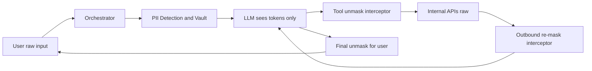
```mermaid
flowchart LR
  User[User raw input] --> Orch[Orchestrator]
  Orch --> Detect[PII Detection and Vault]
  Detect --> LLM[LLM sees tokens only]
  LLM --> Unmask[Tool unmask interceptor]
  Unmask --> API[Internal APIs raw]
  API --> Remask[Outbound re-mask interceptor]
  Remask --> LLM
  LLM --> FinalUnmask[Final unmask for user]
  FinalUnmask --> User
```
