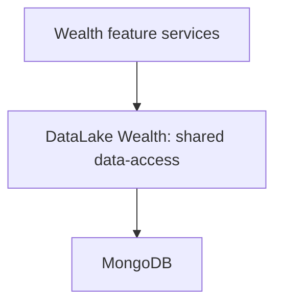

## Problem

Wealth Online services needed the same Mongo-backed data for different consumer banking features. Without a shared access layer, each team reimplemented queries, connection handling, and the operational habits around them — retries, logging, and how access was audited.

That duplicated work. It also made consistency hard: the same collection could be read one way in one service and another way in the next. In a regulated wealth platform, inconsistent data access is not just a maintenance cost — it is an audit and change-management problem.

The problem was not “can we talk to MongoDB.” It was whether wealth services could share one reusable path to data instead of a pile of one-off clients.

## Constraints

DataLake Wealth was shaped by an existing enterprise platform, not a greenfield data product:

- **Fit the stack** — Java / Spring services already owned the domain logic; the access layer had to plug into that model, not invent a parallel runtime.
- **Reuse over rewrite** — multiple consumer features needed the same Mongo-backed data without each owning a private query surface.
- **Operational consistency** — retries, logging, and access patterns had to be shared so ops and audit did not reinvent them per service.
- **Bounded scope** — this is a data-access component for wealth platform services, not a lakehouse, warehouse, or analytics platform. The name describes the role in the platform, not a marketing category.

## Architecture

Feature services do not own Mongo access. They call a shared wrapper. The wrapper owns how queries and document access are expressed against MongoDB for that platform.

**Shared access layer** — query and document patterns live once. Feature teams consume a stable surface instead of copying repository code.

**Platform services stay platforms** — domain orchestration, UX, and product rules stay in the calling services. DataLake Wealth is the reusable path underneath them.

**Mongo stays the system of record for that data** — the wrapper does not become a second source of truth. It standardizes how wealth services reach the collections they already depend on.

This is the same reuse thesis as Eliza4J, applied to data access instead of model integration: one governed place to attach, rather than every team reinventing the client.

## Design decisions

**Why a reusable wrapper instead of service-local repositories?** Local repositories are fine until the fifth team needs the same collections with slightly different habits. A shared component is where consistency and change land once.

**Why not a generic ORM-facing “data lake” product?** Wealth Online needed efficient access for existing platform services. Expanding into analytics pipelines or a multi-store abstraction would have solved a different problem.

**Why keep domain logic out of the access layer?** Mixing product rules into data access couples every consumer to every feature decision. The wrapper stays at the access boundary so features can evolve independently.

**Why ship this as platform engineering, not as an AI project?** Reliable AI sits on reliable platforms. Shared, audited data access is part of that foundation — it does not need an LLM to be worth doing well.

## Outcome

Shipped as a platform component on BNY’s Wealth Online stack and used by multiple consumer banking features. No fabricated adoption metrics — the durable result is a reusable Mongo data-access path instead of duplicated service-local clients.
