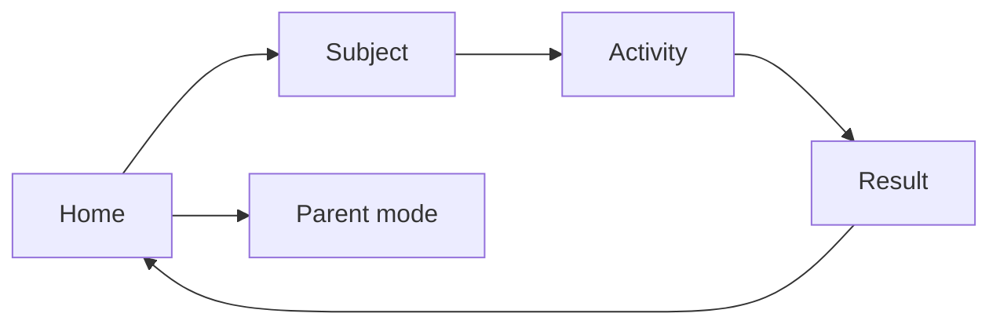

## Problem

Young children learn best through short, playful interaction — not passive screen time. Most early-learning apps add accounts, ads, or cloud tracking that families do not need for nursery practice.

## What I'm building

A privacy-first learning playground for nursery-age children:

- Alphabet, numbers, colors, shapes, animals, and games
- One short activity at a time
- Encouraging feedback and simple stars
- Progress stored locally on the device
- No backend, login, or LLM

Stack: Astro + React on the same static site, JSON-driven activities, localStorage.

## Status

Lab / foundation phase. The first validation slice is live — <a href="/learn/" target="_blank" rel="noopener noreferrer">open the Learning Playground ↗</a> (home → subject → activity → result, with a basic parent progress view).

