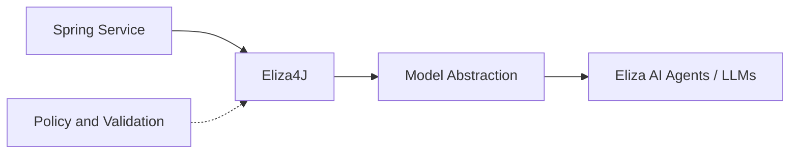

## Problem

Enterprise Java teams were bolting LLMs onto existing services without a governed integration path. Each team built its own HTTP clients, prompt assembly, and agent wiring. That worked in demos, but it did not scale across a regulated platform: no shared patterns, weak boundaries around tool execution, and policy living in prompts instead of architecture.

## Constraints

Eliza4J was shaped by enterprise and regulated-industry requirements, not a standalone AI SDK:

- **Spring-first** — fit existing services, deployment models, and team skills.
- **Governed integration** — least privilege, auditable paths, no ad-hoc side doors to models or tools.
- **Production posture** — reliability and observability matter; this is not a hackathon wrapper around an API.

## Architecture

Eliza4J sits between Spring services and BNY’s Eliza AI Agents and LLMs. Application code calls through the library; the library handles model abstraction and agent hooks. Policy, validation, and authority boundaries stay outside the prompt layer — aligned with how production agents should be built, not how demos are built.

The library does not replace your orchestration or security architecture. It gives Java teams a consistent place to attach agents without every service reinventing the same integration stack.

## Capabilities

- **Model abstraction** — a stable interface to Eliza agents and LLMs without scattering provider-specific HTTP code.
- **Agent hooks** — lifecycle points where services can enforce policy, logging, and validation before and after agent calls.
- **Spring-shaped usage** — patterns that fit how enterprise Java teams already build and deploy services.
- **Governed defaults** — steer teams away from executing tools directly from raw model output or hiding security in system prompts.

## Design decisions

**Why Java and Spring?** Most of the platform already runs on Java/Spring. A library that fits that stack lets teams adopt agents without a parallel runtime or a rewrite.

**Why a library, not a sidecar?** Teams needed integration inside existing services — shared types, deployment units, and operational models. A sidecar would add another moving part without matching how wealth and banking features are actually shipped.

**Why hooks instead of raw model output driving tools?** In production, tool invocation must be validated and bounded. Hooks and abstraction layers keep that control in application architecture, not in whatever the model returns on a given turn.

## Outcome

Shipped internally at BNY as a reusable path for Java teams building on Eliza AI Agents and LLMs. Open-source exploration continues under the same enterprise constraints — no fabricated adoption metrics, but a real framework intent rather than one-off integrations.
