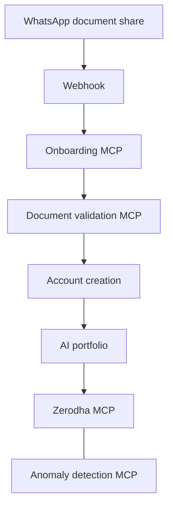

## Problem

Financial onboarding still breaks into disconnected steps: a prospect shares documents, someone validates KYC, an account is opened, a portfolio is proposed, then money moves through a broker. Each hop is a different system, a different owner, and a different chance to drop context.

The FINOS DTCC India AI Hackathon asked for agentic workflows that improve productivity in financial operations. Team CTRL+ALT+GEEKS took the full path — prospect to funded portfolio — rather than a single chatbot over one form.

The workflow we designed:

1. **Prospect onboarding** — the user shares documents over WhatsApp.
2. **KYC** — those documents are validated before the prospect becomes an account holder.
3. **Account creation** — a brokerage account is opened only after validation.
4. **Portfolio** — an AI-generated investment portfolio is proposed.
5. **Investment** — orders go to a Zerodha broker account through Zerodha MCP.
6. **Anomaly detection** — transactions are watched after money moves.

The interesting problem was not “can an LLM talk about KYC.” It was whether those steps could run as a controlled agentic workflow instead of a pile of screens and email.

## Approach

We did not put a single agent in charge of WhatsApp, KYC, brokerage, and surveillance. Each domain stayed a service. Agents and tools sat on top of those services.

WhatsApp was the intake channel: a shared document arrived as an event, not as a paste into a prompt. A webhook received that event and started onboarding. KYC and document validation ran as explicit tool calls, not as “the model looked at the PDF and said it was fine.” Account creation and portfolio generation followed only after that path had a result. Brokerage used Zerodha MCP so investment was a tool boundary, not a free-form instruction to “buy something.” Anomaly detection sat on the transaction stream after execution.

High-impact steps — treating documents as verified KYC, opening an account, placing an investment — had to remain gated. The hackathon was the place to show the shape of that system, not to pretend a weekend demo is a regulated onboarding stack.

## Architecture

Intake is an event. Execution is tools. The model does not own KYC, brokerage credentials, or the ledger.

**Webhook** — WhatsApp document events enter the workflow here. The orchestrator sees a structured intake, not a chat log that happens to contain a file.

**MCP over services** — onboarding, document validation, and anomaly detection were exposed as MCP tools on top of existing services. Specialized work stays in those services; the agent invokes them with a schema instead of reimplementing KYC or surveillance in a prompt.

**Zerodha MCP** — portfolio intent becomes broker actions through a tool interface. Order placement is a bounded call, not raw model output driving the broker API.

**Human / policy gates** — document validation and investment remain the places a production system would require approval or a hard policy check. The architecture leaves room for that; it does not hide those decisions inside a system prompt.

This is the same thesis as the writing on multi-agent routing, validation, planner risk, and a human gateway: specialize the work, validate before irreversible steps, and keep high-impact execution behind a boundary.

## My contribution

I focused on the integration layer that made the workflow callable:

- **Webhook** — receive WhatsApp document events and start onboarding without manual paste into the agent.
- **MCP on services** — wrap user onboarding, document validation, and anomaly detection so agents call those capabilities as tools.
- **Integration** — connect intake, validation, and post-trade detection so the path was one workflow instead of disconnected demos.

Portfolio generation and the Zerodha investment path were team workflow; my work was making onboarding, KYC-style validation, and anomaly detection reachable as governed tools, then wiring them into the rest of the flow.

## Constraints

This was a hackathon, not a production onboarding program:

- **Time** — a vertical slice of prospect → KYC → account → portfolio → broker → surveillance, not a complete KYC policy engine.
- **Documents** — WhatsApp as intake is convenient and messy: image quality, identity vs. the person in the chat, and what “validated” means in a demo vs. a regulated KYC team.
- **Tools** — MCP and broker APIs only do what the server allows. Least privilege still matters when the tool can move money.
- **Models** — an AI-generated portfolio is a proposal. It is not advice, and it is not a substitute for suitability rules.
- **Humans** — KYC sign-off and live investment would need an explicit approval path in production. The demo showed the seams; it did not remove them.

## Outcome

**3rd Prize** among 40+ organizations. Team CTRL+ALT+GEEKS, with BNY, in the FINOS DTCC India AI Hackathon 2025.

The prize is a hackathon result. The durable part is the shape of the system: event intake, MCP over real services, broker actions behind a tool, and anomaly detection after execution — not a chatbot that claims to “do KYC.”

[LinkedIn recap](https://www.linkedin.com/posts/ramalapure_bny-finos-dtcc-activity-7344228253059969027-uqEu)

## What we learned

In production I would not let document validation or order placement run because the model was confident. Validation would be a layered decision — schema, document checks, policy — with a human gateway on KYC and first-time funding. The planner would be checked before a multi-step plan that opens an account and invests. WhatsApp would stay an intake channel, not the system of record. Zerodha MCP would stay a least-privilege tool, with anomaly detection as a separate control, not a prompt that “watches transactions.”

The hackathon proved the workflow can be assembled. Production is where those tools stop being a demo path and become the only path that is allowed to run.
