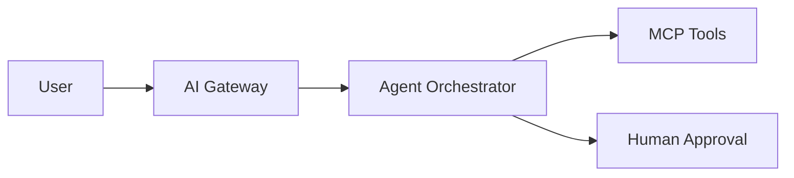

## Problem

Expensive human services (tax, complaints, insurance navigation) need agentic automation with governance — not ten separate chatbots.

## What I'm building

OpenLifeOps — a shared agent platform with vertical packs:

- Consumer (bills, complaints)
- Tax (reconciliation, sanity checks)
- Finance (research, not advice)
- Family (school, travel, home)
- SMB (back-office workflows)

Stack: Spring Boot, Java 21, MCP, RAG, Playwright, hybrid local/cloud inference.

## Status

Lab / architecture phase. Public agents will run on a separate host or subdomain when ready — this site stays static.

