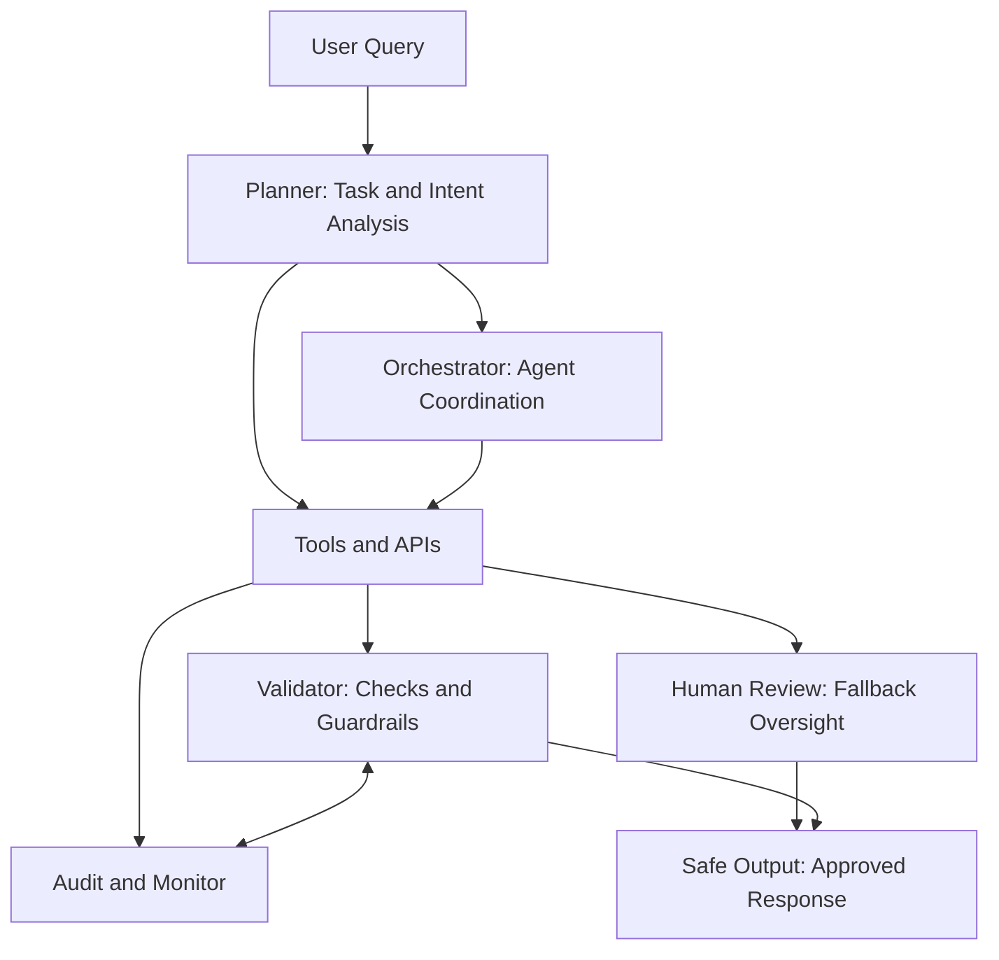

Most AI demos work.

Most AI systems fail in production.

Especially in regulated industries like banking, wealth management, and healthcare. AI cannot just be intelligent, It must be:

- Deterministic
- Observable
- Governed
- Auditable
- Fail-safe

LLMs are probabilistic by design, enterprise systems cannot afford to be. That’s the architectural tension.

In regulated environments, AI agents need more than prompts. They need architecture.

From what I’ve seen, production-grade AI systems require:

- Clear separation between Planner and Orchestrator
- Validation layers before execution
- Strict tool access control
- Deterministic guardrails around outputs
- Human fallback loops
- Full observability and audit trails

The real question is not: “How do we build an AI agent?”

It’s: “How do we make AI predictable?”

The future of enterprise AI won’t be shaped by better prompts, it will be shaped by better architecture patterns.

This is the space I’m actively exploring — designing deterministic AI systems for regulated industries.

Curious how others are approaching this balance between intelligence and control.

A simple control-loop view of deterministic AI architecture for regulated systems.

