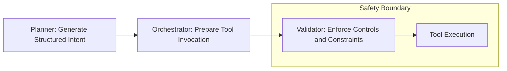

A recurring pattern I’ve seen when AI agents move from demo to production:

Everything works well — until the agent is allowed to execute tools without strict validation.

In controlled environments, model outputs look accurate and well-structured.

But in production, small ambiguities in intent classification or parameter extraction can lead to unintended tool invocation.

Nothing malicious.

Just probabilistic behavior meeting deterministic systems, and that’s the architectural tension.

In regulated industries, an AI agent should never execute actions directly from model output.

There must be a deterministic validation layer between orchestration and execution.

A simplified production-grade flow looks like this:

1. Planner → Generates structured intent
2. Orchestrator → Prepares tool invocation
3. Validator →
   - Checks intent confidence thresholds
   - Enforces role-based access control
   - Validates parameter schema
   - Applies policy constraints
   - Confirms allowed action scope
4. Only then → Tool execution

If validation fails:

- Clarify with the user
- Or route to human review

The difference between a demo agent and a production-grade agent is not prompt quality, it’s architectural control.

As agents gain autonomy, validation becomes the real safety boundary.

Should AI agents ever be allowed to execute critical APIs directly from raw model output?

