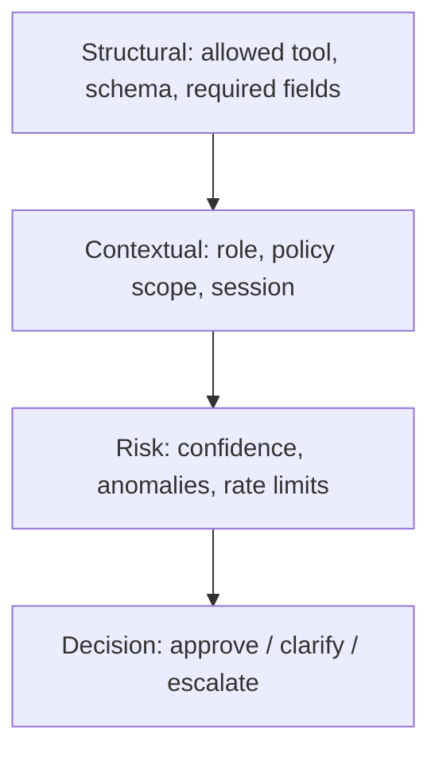

Everyone agrees AI agents need validation before execution.

But what does that validator actually do?

In production systems, a validator is not just a boolean check, it’s a layered decision engine.

A simplified structure looks like this:

**Layer 1 – Structural Validation**

- Is the tool name allowed?
- Do parameters match the schema?
- Are required fields present?

**Layer 2 – Contextual Validation**

- Does the user have the required role?
- Is this action allowed in this session context?
- Is the data scope within policy?

**Layer 3 – Risk Evaluation**

- Confidence threshold met?
- Anomaly detection triggered?
- Rate limits exceeded?

**Layer 4 – Decision**

- Approve execution
- Ask for clarification
- Escalate to human

The insight: Validation is not a single gate, it’s a layered risk model.

That’s what transforms AI agents from experimental systems into production infrastructure.

How are others structuring layered decision logic in agent architectures?

