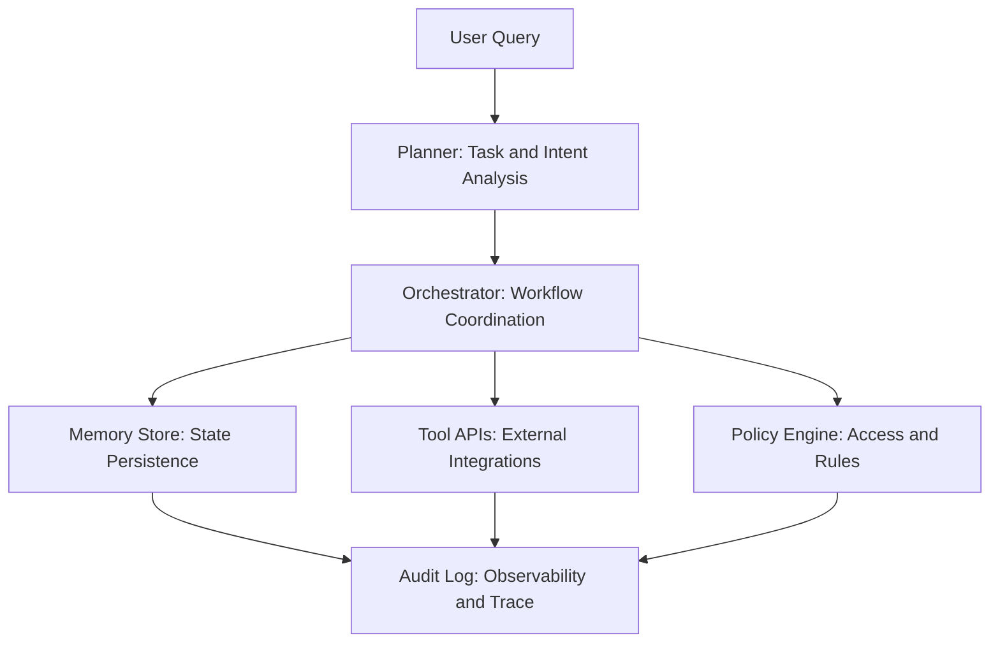

AI agents are often discussed as “smarter prompts.”

In production, they behave more like distributed systems.

Once an agent becomes multi-step, long-running, or tool-driven, you’re no longer just managing generation, you’re managing coordination.

Think about what actually happens in a real workflow:

- Intent planning
- Tool invocation
- Memory updates
- Policy checks
- State transitions
- Retry logic
- Audit logging

That’s orchestration and it introduces classic distributed systems challenges:

- State drift across steps
- Partial execution failures
- Idempotency requirements
- Tool timeouts
- Inconsistent memory writes
- Race conditions in concurrent flows

The failure mode is rarely “bad text", it’s broken state.

When we start modeling AI agents as stateful orchestrators rather than reasoning engines, design decisions change:

- Explicit state boundaries
- Deterministic transitions
- Clear failure recovery paths
- Observability at each step
- Controlled side effects

The intelligence matters, but the coordination layer determines reliability.

Are others treating agent systems as distributed workflows rather than prompt pipelines?

