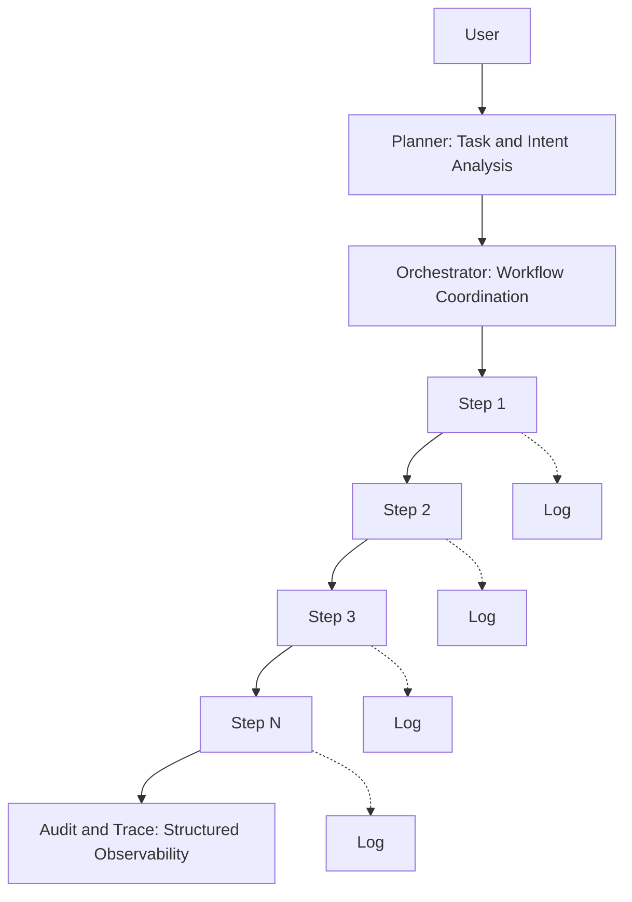

AI agents don’t just fail at execution, they fail at observation.

In demos, if something goes wrong, we rerun the prompt.

In production systems, that’s rarely an option.

Once an agent orchestrates multiple steps — tool calls, memory updates, policy checks — failures become harder to detect and even harder to recover from.

Consider a few realistic scenarios:

- A tool call partially succeeds but returns incomplete data
- A retry unintentionally duplicates a side effect
- Memory is updated before execution fully completes
- A downstream API times out, but reasoning continues
- State drifts silently across multi-step workflows

The failure isn’t always visible and that’s the problem.

In distributed systems, reliability depends on:

- Step-level logging
- Correlation IDs across workflows
- Deterministic checkpoints
- Clear retry boundaries
- Defined rollback strategies

Agentic systems require the same discipline.

Without structured observability, autonomy becomes opaque automation.

As agents gain more autonomy, traceability and controlled recovery become more important than generation quality.

Curious how others are instrumenting agent workflows for step-level visibility and safe failure handling.

