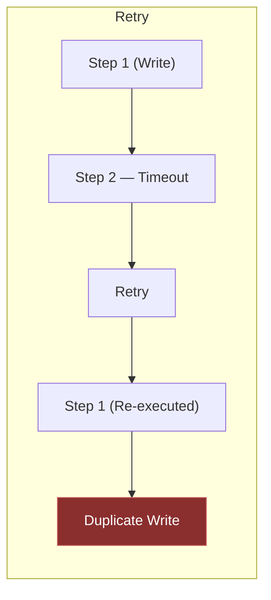
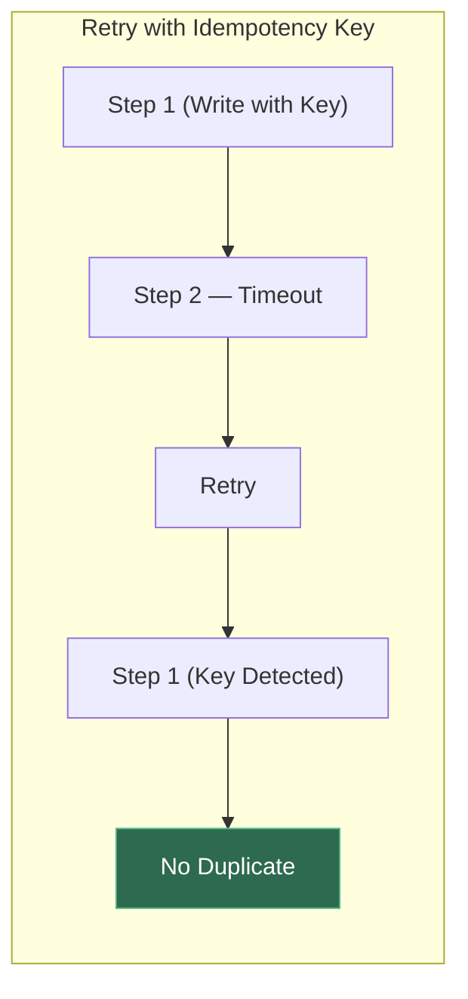

Retries don’t automatically create reliability.

In multi-step AI agent workflows, they can introduce new failure modes.

Consider a simple execution flow:

- Step 1 — writes to a database
- Step 2 — calls an external API
- Step 3 — updates memory state

Now imagine Step 2 times out.

The system retries the workflow, but Step 1 already committed.

Without idempotent boundaries, the retry doesn’t restore consistency — it duplicates side effects.

In distributed systems, this is a familiar problem. We address it using:

- Idempotency keys
- Deterministic checkpoints
- Explicit state transitions
- Clear separation between reasoning and write operations

Agent systems require the same discipline.

Autonomy increases the surface area for unintended side effects.

Resilience isn’t just about retry logic, it’s about controlled state progression and replay-safe execution paths.

As agents become more capable, idempotent design becomes foundational — not optional.

Curious how others are designing safe retry strategies in multi-step agent workflows.

