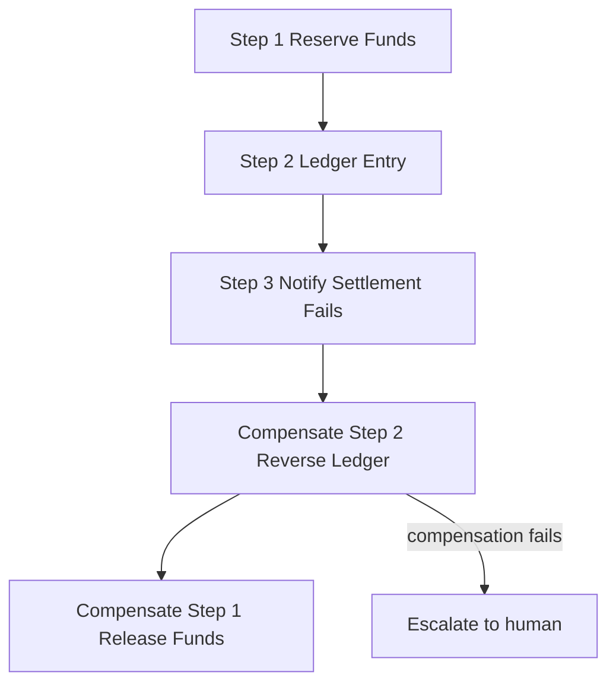

AI agents don’t just fail at execution, they fail at state consistency.

In multi-step workflows, retries are often treated as recovery.

But retries handle transient failure — not state rollback.

Consider this sequence:

- Step 1 → Reserve Funds (Committed)
- Step 2 → Ledger Entry (Committed)
- Step 3 → Notify Settlement (Fails)

If Step 3 fails:

You retry.

You retry again.

Eventually retries exhaust.

What remains?

- Funds reserved
- Ledger updated
- No settlement confirmation

The system is now in an inconsistent state.

Retry loops cannot revert committed steps.

This is where the Saga pattern becomes necessary.

Instead of retrying forward, the system compensates backward:

- Step 3 fails
- Compensate Step 2 (Reverse Ledger Entry)
- Compensate Step 1 (Release Funds)

State is restored, but here’s the part most people ignore: Compensation can fail too.

If reverse ledger entry fails, you now need escalation:

- Human intervention
- Manual reconciliation
- Audit visibility

Agents orchestrating multi-step tool calls are effectively distributed transaction coordinators.

Distributed coordination requires:

- Retry policies
- Compensation logic
- Escalation paths

Not just better prompts, compensation logic is critical for state restoration.

Plan for compensation failures with escalation protocols.

Curious how others are handling compensation and failure escalation in agent workflows?

