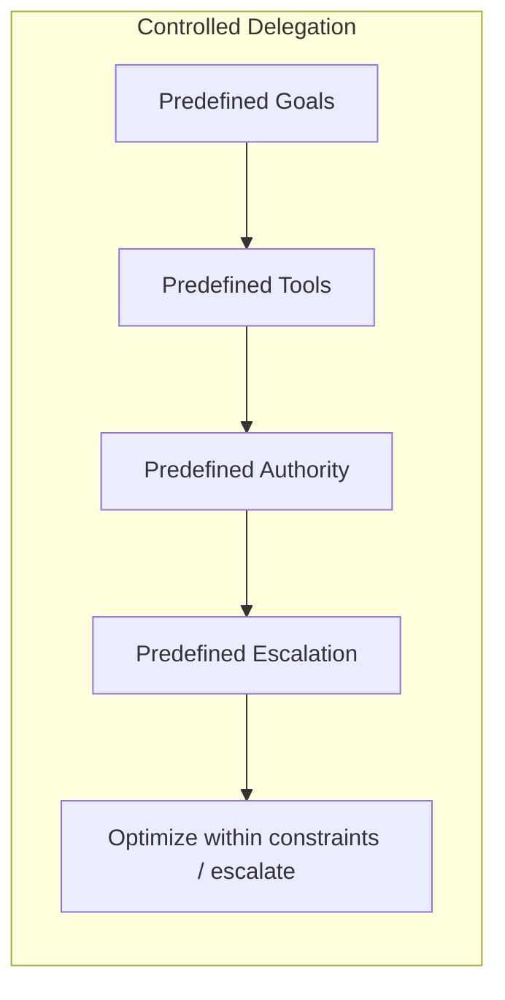
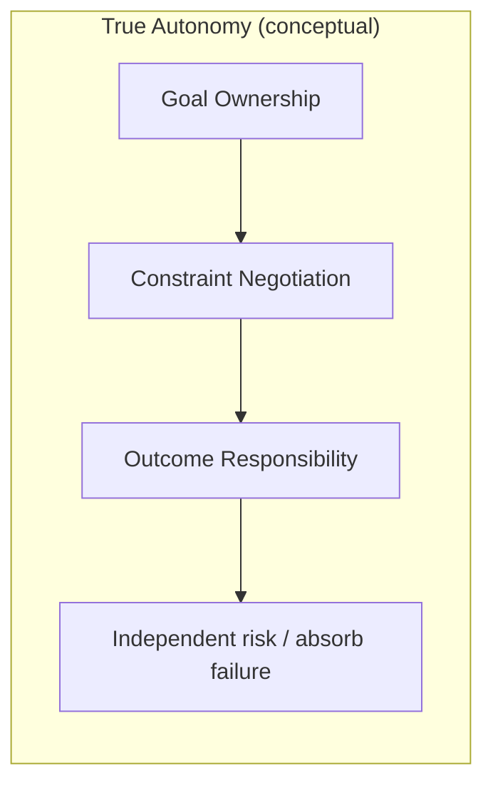

The Illusion of Autonomous Agents

We keep calling them autonomous, technically most aren’t.

An autonomous system must satisfy at least three properties:

1. Goal ownership – It can define or refine objectives.
2. Constraint negotiation – It can resolve conflicting requirements.
3. Outcome responsibility – It can absorb failure without external intervention.

Most production “agents” satisfy none of these.

They operate under:

- Predefined goals
- Predefined tools
- Predefined authority scope
- Predefined escalation paths

They optimize within constraints, they do not redefine them.

When something ambiguous happens, the system does not adapt its objectives, it escalates.

That’s not autonomy, it's bounded optimization.

Technically, what we’ve built are:

- Decision pipelines with probabilistic routing
- Tool selection layers
- Policy-constrained executors
- Structured orchestration graphs

They are adaptive inside a sandbox.

True autonomy would require:

- Dynamic goal reformation
- Authority expansion or contraction
- Independent risk evaluation
- Self-modifying execution plans

We are nowhere near that in production systems, and that’s intentional.

Because real autonomy implies real risk.

The term “autonomous agent” is a marketing abstraction.

The implementation reality is: Controlled delegation.

If your agent cannot redefine success criteria or operate beyond predefined authority, it isn’t autonomous.

It’s automated with adaptive inference.

What level of autonomy would you actually allow in a production system?

