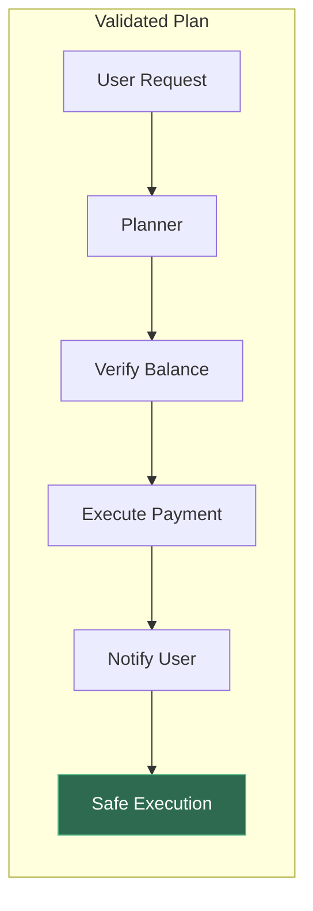
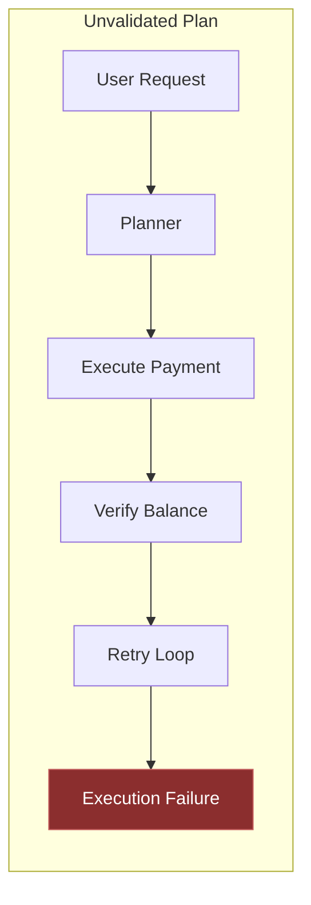

In most agent discussions, the focus is on the model.

But in production systems, the real risk sits elsewhere.

The planner.

The planner decides:

- which tools to call
- what sequence to execute
- how the workflow unfolds

In other words, it defines the execution graph of the system.

Once a plan is created, the orchestrator simply runs it.

Which means a flawed planner can introduce failures even when the model is correct and the infrastructure is stable.

Common planner failure modes in agent systems:

- Incorrect step ordering — Critical validation steps happen after irreversible actions.
- Wrong tool invocation — The planner selects the wrong capability for the task.
- Infinite planning loops — The system repeatedly generates new reasoning steps with no termination condition.
- Unbounded execution chains — Each step spawns additional sub-steps, expanding the workflow unexpectedly.
- Cost amplification — Planning loops trigger repeated model calls and tool executions.

Unlike reasoning errors, planner failures are difficult to detect.

- The outputs may look valid.
- The tools may execute successfully.

But the execution path itself is wrong.

In production architectures, the planner is effectively the control layer of the agent.

Which means the most important question isn’t: “Is the model correct?”

It’s: “Is the plan safe to execute?”

Curious how others are validating planner decisions before execution in agent workflows.

