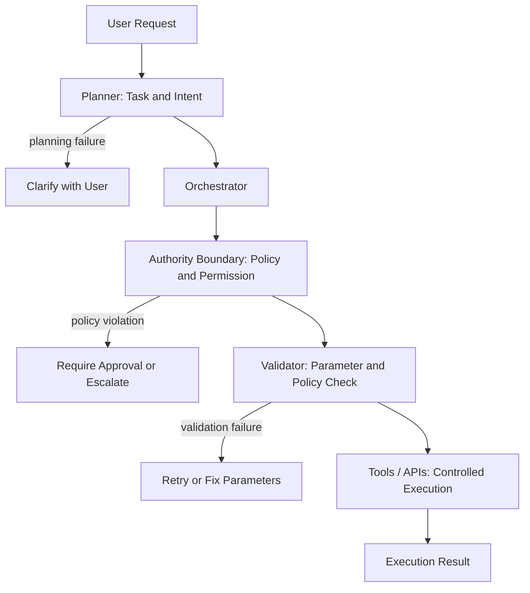

Agents Need Authority Boundaries

In many agent systems, the planner generates a plan and the system proceeds to execute it.

But production-grade agents cannot execute everything they plan.

Because agents operate in environments with real consequences:

- financial transactions
- customer data access
- external API calls
- system configuration changes
- long-running workflows

A plan may be logically correct — but still outside the agent’s authority.

For example:

- sending an email may be allowed
- transferring funds may require approval
- modifying records may require policy checks
- triggering workflows may exceed limits
- calling external APIs may require permissions

This is why production agent architectures introduce authority boundaries.

In production systems, execution is not triggered directly by the planner.

Instead, multiple control layers decide what is allowed to run.

Each layer has a different responsibility.

- Planner → decides what should be done
- Orchestrator → coordinates the workflow
- Authority Boundary → decides what the agent is allowed to do
- Validator → checks parameters, policies, and safety rules
- Tools / APIs → execute actions in a controlled way

Actions outside the allowed boundary are:

- rejected
- restricted
- require approval
- or escalated to humans

Because the real challenge in agent systems isn’t generating plans, it’s controlling how much power the agent has to execute them.

Curious how others are defining authority boundaries in production agent architectures.

