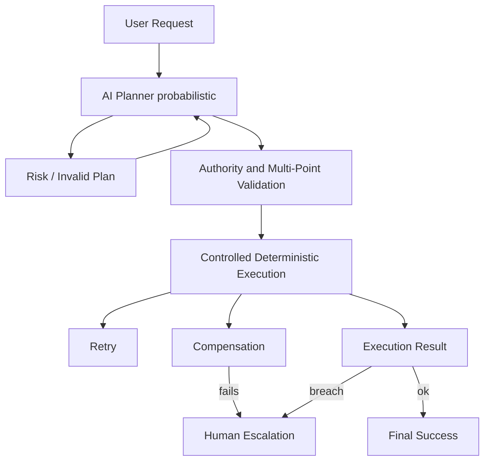

10 Architecture Lessons from Building Production-Grade AI Agents

Over the last few weeks, I shared a series of posts about designing production-grade AI agents.

Not demos.

Not toy workflows.

Real systems with control, safety, and failure handling.

While writing these posts, one thing became clear:

Production agents are not just LLM calls, they are layered systems.

Here is a quick recap of the first 10 posts in the series:

1. [Demo Agents vs Production Agents](/writing/post-01/) — Production agents need deterministic control layers
2. [Guard Layer Pattern](/writing/post-02/) — LLM output should pass through a safety / guard layer
3. [Validation Layer in Agent Systems](/writing/post-03/) — Agents should validate tool calls before execution
4. [Agents are Distributed Systems](/writing/post-04/) — The failure mode is rarely "bad text", it's broken state
5. [Agent Failures Need Observability](/writing/post-05/) — You cannot fix what you cannot trace
6. [Retry vs Compensation](/writing/post-06/) — Retries handle transient failures, not state rollback
7. [Compensation + Escalation Pattern](/writing/post-07/) — Compensation may fail → need escalation
8. [Illusion of Autonomous Agents](/writing/post-08/) — Production agents run inside controlled boundaries
9. [Planner Risk in Agent Systems](/writing/post-09/) — Wrong plans can break the system
10. [Authority Boundaries in Agents](/writing/post-10/) — Agents should not execute everything they plan

Across these posts, a pattern emerges. Production AI agents usually need:

- Planner
- Orchestrator
- Authority Boundary
- Validator
- Controlled Execution
- Retry / Compensation
- Escalation
- Observability

Planning is probabilistic. Execution must remain deterministic.

I’ll continue the series with deeper topics on production agent architecture.

If you’ve been following the journey — thank you. If you’re new, this post is a good place to start.

Let me know what you think of the architecture diagram in the comments!

