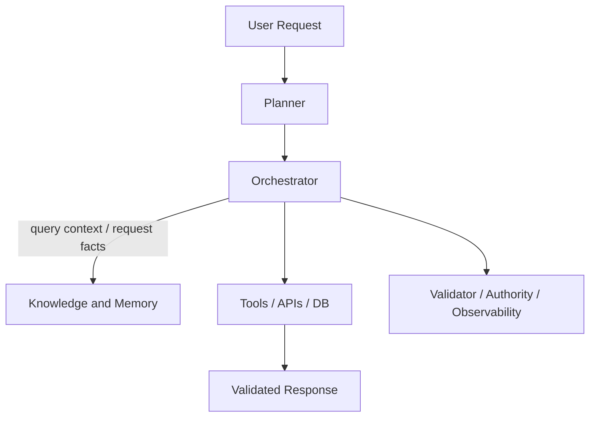

In the [last 10 posts](/writing/post-11/), we built the core architecture for production-grade AI agents:

- Planner
- Orchestrator
- Validator
- Authority Boundary
- Retry / Compensation
- Observability

But one critical layer is still missing — Knowledge.

Not just conversation history.

Not dynamic prompt context.

Real, authoritative knowledge.

Production agents must know where the truth comes from.

**The Demo Agent: Model as Database**

User → LLM → Answer

The classic prototype flow. It works in a demo, but it fails in production. When you rely on the LLM's internal memory:

- The model relies on frozen weights (static training data).
- The model guesses.
- The model hallucinates.

The architecture is too fragile for real business.

**The Production Agent: Model as Processor**

- User Request
- Planner
- Orchestrator
- Knowledge Layer (RAG/DB)
- Tools / APIs
- Validator
- Authority Boundary
- Retry / Compensation
- Observability
- Response

In production, the agent does not rely on knowledge stored inside the model.

The LLM is the reasoning engine, not the database. The architecture must retrieve facts from reliable systems of record.

**Why a Knowledge Layer is Non-Negotiable**

Production agents are required to handle high-stakes data that an LLM cannot store safely or update dynamically:

- Customer transaction history
- Real-time inventory levels
- Proprietary policy documents
- Live enterprise API schemas

The architecture must provide this ground truth. This is where RAG (Retrieval-Augmented Generation), vector databases, structured DBs, and API integrations become foundational.

**The Four Types of Memory in Production Agents**

A production agent uses different memory systems simultaneously. They are not interchangeable:

1. Short-term memory → User conversation state (the chat history).
2. Long-term memory → Knowledge base (Vector DB / RAG).
3. System memory → Agent workflow state / execution context.
4. Enterprise knowledge → Structured systems of record (SQL, APIs).

Not just chat history. Reliable agents use all four.

**The Key Rule**

LLM generates text.

Knowledge layer provides facts.

Orchestrator controls usage.

Validator checks output.

Reliability comes from architecture, not from prompt engineering.

