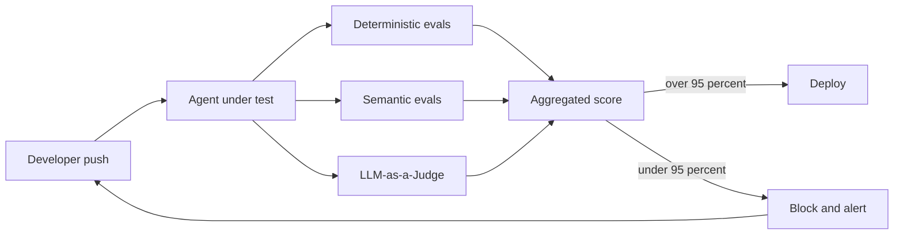

We spent the [last 12 posts](/writing/) building a rock-solid, enterprise-grade AI architecture.

Planner. Orchestrator. Validator. Knowledge Layer, etc.

You built it. It runs.

But how do you know it won't break tomorrow?

Traditional software has unit tests.

AI agents need Evals.

**Demo Agent Testing**

Run a prompt.

Read the output.

"Looks good to me." (LGTM)

Works for prototypes.

Disaster for production.

You cannot manually QA a non-deterministic system.

**Production Agent Testing (Evals)**

Production teams treat AI like a CI/CD pipeline. Every change to a prompt, tool, or routing logic must pass an automated evaluation suite before deployment.

We test for:

1. Accuracy — Did it get the right facts from the Knowledge Layer?
2. Format — Did it output clean JSON?
3. Tone/Policy — Did it stay within the Authority Boundary?
4. Latency — Did the Orchestrator take too long to plan?

**The 3 Layers of Agent Evaluations**

1. Deterministic Evals (The Basics)

   Standard code checks.

   - Did the agent call the right API?
   - Is the output exactly 250 words?
   - Does the JSON schema match?

   Fast, cheap, binary.

2. Semantic Evals (The Middle Ground)

   Vector math.

   - Is the meaning of the answer mathematically similar to our "Golden Dataset" of perfect answers?

   Catches hallucinated terminology.

3. LLM-as-a-Judge (The Heavy Lifter)

   Using a stronger, slower model to grade your agent's output based on a strict rubric.

   - "Did the agent politely decline to answer out-of-scope questions?" (Pass/Fail)

   Scales human-level judgment.

**The CI/CD Flow for AI**

Developer tweaks the system prompt

↓

Triggers Eval Pipeline (100 test cases)

↓

Deterministic checks run

↓

LLM-as-a-Judge grades responses

↓

Score drops below 95%? Deployment blocked.

**Key Rule**

If you can't measure it automatically, you can't scale it.

Vibe checks are not a testing strategy.

