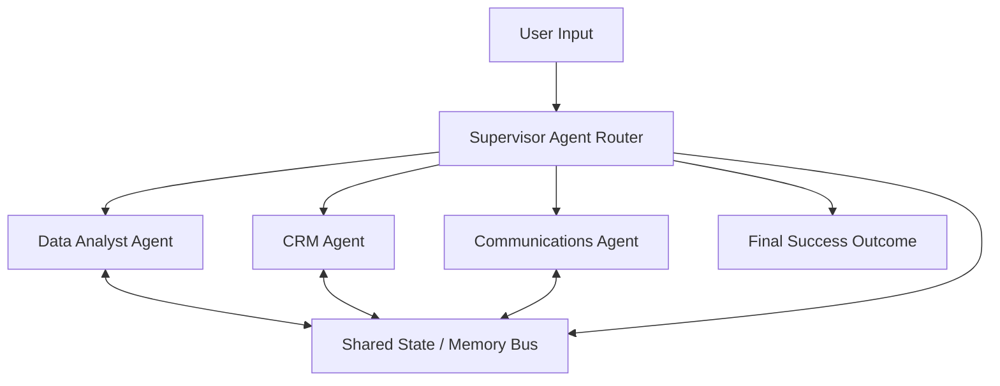

We’ve spent the [last 13 posts](/writing/) building a production-grade AI agent.

It works beautifully. Until the system scales.

What happens when your enterprise agent needs:

- 50+ tools
- Multiple isolated databases
- Complex, multi-step workflows
- Cross-domain business logic

If you stuff all of that into one Orchestrator prompt…

The system collapses.

This is where most demo architectures fail.

**Demo Architecture — The God Agent**

One agent. One massive prompt. All the tools.

Everything is shoved into a single context window.

Result:

- Wrong tool calls
- Hallucinated data
- Context overflow
- Unpredictable execution

The bigger the prompt, the less reliable the agent.

**Production Architecture — Supervisor & Worker Pattern**

Enterprise systems don’t rely on a single monolithic service.

They use specialized components.

Production AI should do the same.

Instead of one God Agent, we build a Supervisor + Worker architecture.

**1. Supervisor Agent (The Router)**

The supervisor does not execute tools, its only job is to:

- Classify user intent
- Break the task into steps
- Route work to the right agent
- Coordinate the shared state

It is the control plane.

Flow: User → Supervisor → Workers → Supervisor → Result.

**2. Worker Agents (Specialized & Narrow)**

Each worker has a narrow prompt, a small toolset, and a clear responsibility.

For example: "Analyze Q3 revenue, update the CRM, and email the VP."

- Data Analyst Agent → SQL + Python only
- CRM Agent → CRM APIs only
- Communications Agent → Email + Templates only

Fewer tools = fewer mistakes.

Narrow prompts scale infinitely better than giant prompts.

**3. Shared State / Agentic Memory Bus**

Workers don’t talk to each other directly.

(That causes infinite loops).

Workers write their results to a shared state.

The Supervisor reads that state and decides the next step.

Worker → State

State → Supervisor

Supervisor → Next Worker

This keeps the system controlled. Not chaotic.

**The Architecture Rule**

One agent → Demo

Multi-agent routing → Production

Big prompts → Unstable

Narrow agents → Predictable

