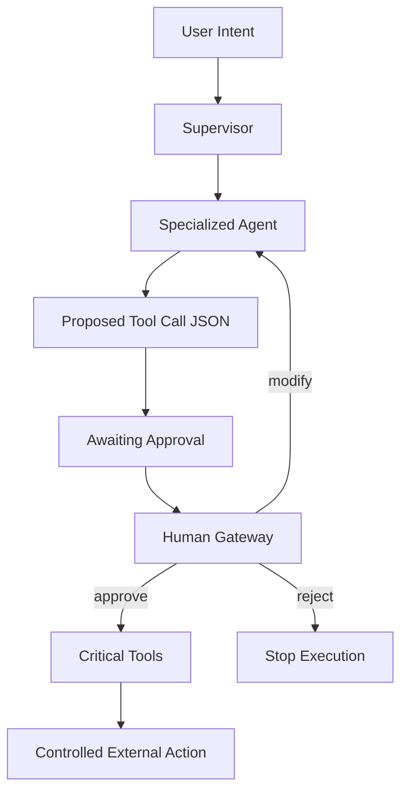

We’ve [built the system](/writing/)

Multi-agents ✔️

Shared memory bus ✔️

Routing + orchestration ✔️

It’s efficient.

It’s powerful.

But it’s still probabilistic.

**The Enterprise Reality**

In enterprise systems, the cost of being wrong isn’t theoretical—it’s a liability.

What happens when an agent:

- Deletes “inactive” leads that are actually high-value?
- Executes flawed code on a production database?
- Sends a confidential contract to the wrong recipient?

You can test for 1,000 edge cases.

The 1,001st will happen in production.

Enterprise agents need probation and probation needs a Human Gateway.

**The Pattern: Human Gateway (HITL Done Right)**

This isn’t just feedback.

It’s an architectural control point.

We don’t remove probabilistic systems— we contain them with deterministic boundaries.

**Demo Architecture — Full Autonomy (The Risk)**

Flow:

Supervisor → Comms Agent → Tool Execution

Directive: “Draft and send email”

The Failure: The agent directly executes the tool call.

If the model hallucinates, the action is already irreversible.

No checkpoint.

No rollback.

No control.

**Production Architecture — Human Gateway Pattern**

We introduce a Pause State before critical actions.

Workflow Shift

- Draft & Execute
- Draft & Propose

**Execution Mechanism**

- Worker generates proposed action (e.g., email draft)
- Writes tool call (JSON) to Shared State
- Sets status → `AWAITING_HUMAN_APPROVAL`
- Orchestrator pauses execution
- State is surfaced to a Human-in-the-Loop interface

**The Gatekeeper (Human Operator)**

At this boundary, human input becomes deterministic control:

- Approve → Execution resumes
- Reject → Workflow stops or compensates
- Modify → Human-adjusted execution

System resumes only after validated input.

**The Architecture Rules for 2026**

1. Reasoning → Probabilistic — Used for: Exploration, drafting, demos — Mode: Fast, flexible, non-binding
2. Execution → Deterministic — Used for: Production actions — Mode: Controlled, validated, auditable
3. Non-Critical Tasks → Automate — Examples: Logs, summaries, tagging — Mode: Straight-through processing
4. High-Stakes Actions → Human Gateway — Examples: Financial, PII, external communication — Mode: Draft → Propose → Approve

**Final Thought**

The goal is not full autonomy.

The goal is controlled, trusted autonomy.

Not agents that act fast—

but systems that pause, validate, and then act safely.

The Human Gateway is what transforms an experimental agent into an enterprise-ready system.

