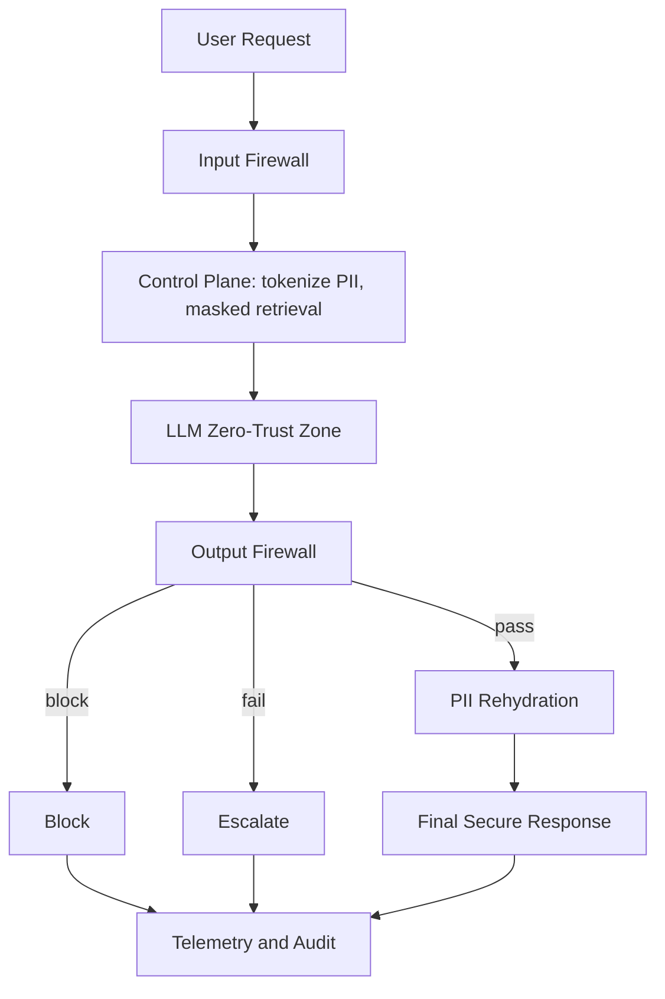

In a demo, a system prompt is enough.

In Enterprise Production, a system prompt is a liability.

If your defense against prompt injection or PII leakage is just a "Please don't do this" instruction, you aren't building architecture. You’re building on hope.

**The Enterprise AI Firewall Pattern**

To move to a deterministic system, security must be a decoupled architectural layer, not a prompt. By isolating the LLM in a "Zero-Trust Zone," we move from probabilistic "vibes" to architectural guarantees.

**The 5-Tier Deterministic Security Pattern**

1. **Input Firewall (Deterministic Guardrails)**
   - Structural Validation: Use Schema and Regex checks to enforce data types before they reach the model.
   - Intent Mapping: Requests are cross-referenced against a Deterministic Rule-Set. If the intent isn't authorized, the request is killed before it ever touches the LLM.

2. **Control Plane (The Deterministic Core)**
   - Context Shadow: PII Tokenization swaps sensitive data for tokens (e.g., `USER_88`).
   - Secure Retrieval: The LLM never sees your "raw" database. It only interacts with a Masked Knowledge Layer.

3. **Output Firewall (The Guard)**
   - Leakage Scanning: Real-time scanning for Secrets, PII, or API keys in the generated response.
   - Policy Validation: Cross-checking the output against enterprise compliance rules.

4. **Safe Delivery (The Decoupled Rehydration)**
   - Conditional Logic: PII Rehydration happens only after a validated 'Pass' signal. We never trust the LLM to handle raw PII in its internal reasoning space.

5. **Telemetry & Audit (The Observability Stack)**
   - Centralized Logging: Every block, pass, and escalation is fed into your Enterprise SOC.
   - Anomaly Detection: Real-time monitoring of policy usage to detect evolving jailbreak patterns.

**The Architect's Take**

Security is Middleware.

Compliance teams and CISOs don't care about "good prompts"—they care about verifiable controls. By wrapping the untrusted LLM in a deterministic firewall, you provide the safety audit trail required for regulated industries like banking and healthcare.

How are you "hardening" your agentic workflows for production?

