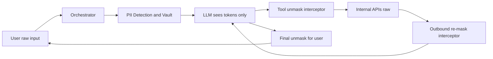

Most AI applications mask PII once before sending a prompt to the LLM. That works for simple chatbots. But Agentic AI is different.

An AI agent reasons, invokes tools, receives API responses, plans the next action, and repeats the process. If sensitive information is only masked at the front door, new PII introduced by internal APIs can silently leak back into the LLM during subsequent reasoning steps.

The solution isn't better system prompts. It's building a continuous PII Protection Gateway (an AI Firewall) for bidirectional masking.

Here is how enterprise architectures secure multi-turn agent workflows:

**Step 1: Layered PII Detection**

Relying purely on Regex causes massive false positives. Robust detection pipelines combine multiple techniques to find the data:

- Regex & Checksums: (e.g., Luhn algorithm to validate credit cards).
- Context-Aware Rules: Scanning for proximity keywords (like "Acct:") near numbers.
- Small Model NER

**Step 2: Tokenization & Vaulting**

Active agents can't execute APIs with `[REDACTED]` data. Instead of destroying the data, replace PII with deterministic tokens:

Raw: `"John Doe, Account 12345"` → Masked: `"[USER_A], [ACCOUNT_B]"`

The true values are stored securely inside a session-bound Token Vault.

**Step 3: Bidirectional Tool Protection**

Protection must happen on every reasoning cycle:

- Tool Request: The LLM requests an action using only tokens.
- Intercept & Unmask: The gateway resolves the tokens via the vault so internal enterprise APIs receive the real values.
- Outbound Re-Masking: The API returns raw data. The gateway detects and tokenizes any new PII before feeding the context back to the LLM for its next turn.

**The Architectural Principle**

Treat PII Protection as an active AI Firewall, not a preprocessing step. The LLM never becomes the custodian of your secrets—it simply reasons over tokens. Your deterministic architecture holds the keys.

How is your team handling PII across multi-step agent workflows?

